# Deep Research (Lead Agent Main Routing Instruction)

This skill utilizes a **modular phased instruction architecture**. To prevent context bloat and downstream LLM output truncation (avoiding `max_output_tokens` limits) when compiling long reports, core execution details are partitioned into specialized phase files.

The Lead Agent **MUST execute this workflow phase-by-phase**, and only load and strictly execute the corresponding sub-phase instructions when transitioning to that phase.

---

## 📐 Phased Lifecycle & Routing Map

```mermaid
stateDiagram-v2
    [*] --> PreFlight: 接收用户请求

    state PreFlight {
        [*] --> VerifyCognitive: 执行 Pre-flight 认知校验
    }

    PreFlight --> P0_Setup

    state P0_Setup {
        [*] --> InitWorkspace: 探测环境与历史
        InitWorkspace --> CreateRoots: 初始化 root artifacts (task.md, plan.md, brief.md)
        CreateRoots --> Git1: Git Commit 1/3 (plan-initialized)
    }

    P0_Setup --> P1_Taskboard

    state P1_Taskboard {
        [*] --> Decompose: 拆解子任务
        Decompose --> Assign: 分配任务到 task.md
    }

    P1_Taskboard --> P2_Dispatch

    state P2_Dispatch {
        [*] --> Subagents: 调度 Subagents 执行深度搜索
        Subagents --> Findings: 产出 findings/task-*.md
    }

    P2_Dispatch --> P3_Wash

    state P3_Wash {
        [*] --> WashCitations: 运行 wash_citations.py
        WashCitations --> SMIS: 审计多媒体资源 (artifacts.md)
    }

    P3_Wash --> P4_Outline

    state P4_Outline {
        [*] --> DesignOutline: 规划 chapters/outline.md
        DesignOutline --> MapEvidence: 映射证据与图表
    }

    P4_Outline --> P5_Drafting

    state P5_Drafting {
        [*] --> DraftChapters: 分片撰写 chapters/*.md
        DraftChapters --> Merge: 运行 merge_chapters.py
        Merge --> Git2: Git Commit 2/3 (draft-written)
    }

    P5_Drafting --> P6_P7_Review

    state P6_P7_Review {
        [*] --> CounterReview: 运行对抗性审查 (review.md)
        CounterReview --> Verify: 校验引文与图表
        Verify --> Git3: Git Commit 3/3 (report-finalized)
    }

    P6_P7_Review --> [*]
```

---

## 🔀 Output Language Adaptation (CRITICAL)

- **Adaptive Core Rule**: While the internal prompts, checklists, and guides in this skill are written in standard **Silicon Valley English**, the language of the final generated outputs (including `task.md`, `findings/task-*.md`, the final `report-<timestamp>.md`, and all **media/HTML wrappers**) MUST dynamically adapt to the user's primary input language context.
- **Language Matching**:
  - If the user interacts primarily in **Chinese**, the generated research findings, reports, and image/media descriptions (SMIS) MUST be compiled in **Chinese**.
  - If the user interacts primarily in **English**, all outputs MUST be compiled in **English**.
  - Always respect explicit language descriptors or system configurations if provided.

---

## 🚀 Execution Core Principles

1. **Lazy Loading**: Only read a phase's reference file when transitioning into it. Do NOT clutter the context by loading unrelated phase instructions in advance.
2. **Workspace as Long-Term Memory (Context Optimization)**: For super-large research projects, agents (Lead and Subagents) MUST atomize tasks and drop older context to avoid memory overflow. All agents MUST share states via a flat directory structure (`memories/`, `findings/`, `clues/`, `hypotheses/`). Agents should periodically read these folders to sync state, and explicitly write any valuable discoveries or guesses into them as Markdown files.
3. **Environment & History Probing**: In P0, discover active drawing/illustration skills (like `doc-illustrator`), fact-checkers, and historic projects in `$HOME/projects/`. Use Grill-Me interaction to align on audience, depth, and cross-domain references.
4. **Adaptive Deep Digging**: In P2, restrict subagents with Breadth and Depth parameters, allowing them to recursively follow citations and pool knowledge.
5. **SMIS (Semantic Media Integration Standard)**: All visual and media assets (crawled web images, generated PNGs, or videos) MUST carry a rich, context-inferred description directly inside standard Markdown Alt-text (``), or wrapped inside standard semantic HTML elements (like `<figure>`, `<figcaption>`, `
`, `
`) to ensure full visual-less accessibility, clean Markdown layouts, and native downstream LLM comprehension.
6. **Stream-Appending with Resume Support**: In P5, compile chapters as individual files in `chapters/`, then merge into `report-<timestamp>.md`. Track progress in `task.md`. If a crash occurs, resume seamlessly from the first pending chapter.
7. **Non-blocking Git Integration**: Silent Git commits are restricted to **three primary lifecycle commits** and run silently if the Git CLI is active. If Git is unavailable, log a warning and continue without throwing an error.

---

## 📁 Reference Directory Index

- **[Pre-flight] Cognitive Checklist**: [pre_flight_cognitive_checklist.md](references/pre_flight_cognitive_checklist.md)
- **[P0] Setup, Probing, & Intake Initialization**: [p0_setup.md](references/phases/p0_setup.md)
- **[P1] Task Decomposition & KANBAN Setup**: [p1_taskboard.md](references/phases/p1_taskboard.md)
- **[P2] Subagent Dispatch & Recursive Exploration**: [p2_dispatch.md](references/phases/p2_dispatch.md)
- **[P3] Citation Washing & Semantic Media Audit**: [p3_wash_governance.md](references/phases/p3_wash_governance.md)
- **[P4] Outline Design & Visualization Planning**: [p4_outline.md](references/phases/p4_outline.md)
- **[P5] Segmented Drafting & Stream-Appending**: [p5_drafting_append.md](references/phases/p5_drafting_append.md)
- **[P6/P7] Review, Verification, & Project Packaging**: [p6_p7_review_verify.md](references/phases/p6_p7_review_verify.md)
- **[Enterprise] Specialized Corporate Analysis Overlay**: [enterprise_workflow.md](references/enterprise_workflow.md)
