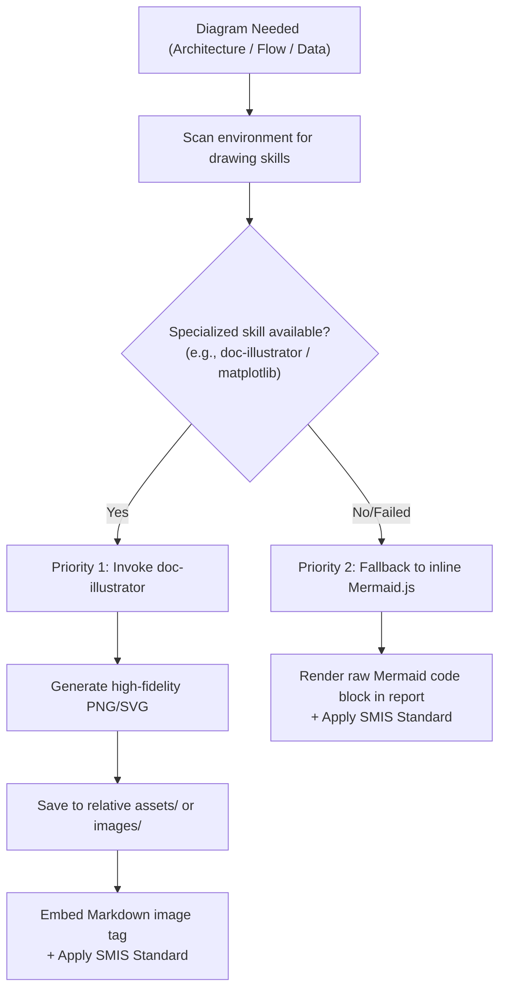
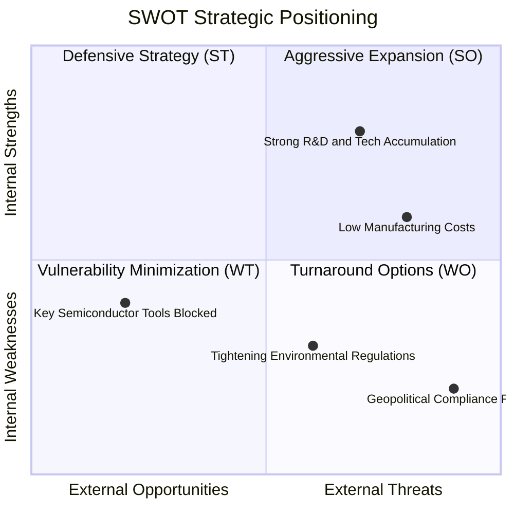
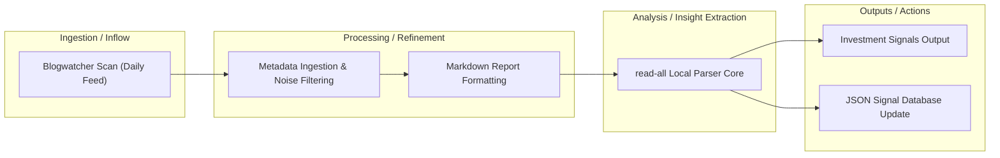

# Deep Research Data Visualization & Diagram Fallback Guide

To clearly present complex data, processes, and industry relationships, the Lead Agent MUST introduce high-quality visual diagrams. This guide defines the visual tool discovery, fallback policy, Mermaid coding standards, and the **Semantic Media Integration Standard (SMIS)**.

---

## 1. Diagram Fallback & Tool Discovery Policy

When a diagram or illustration is planned (e.g., system architecture, pricing line charts, process workflows), follow this two-tier routing workflow:

### 1.1 Priority 1: Specialized Illustration (doc-illustrator)
- Scan for active drawing skills (like `doc-illustrator`) or Python libraries (`matplotlib`, `seaborn`).
- Invoke `doc-illustrator` using its assembled prompt and guidelines to output a high-fidelity image file.
- Save the asset under `assets/` or `images/` within the project root directory.
- Embed the image in `report.md` using the standard Markdown image link wrapped in SMIS Pattern A (descriptive Alt-text) or Pattern B (semantic `<figure>` HTML wrapper).

### 1.2 Priority 2: Mermaid Inline Fallback
- If `doc-illustrator` is missing or fails, write a raw Mermaid.js text diagram directly inline in the Markdown report.
- Protect all node text with double quotes and use unique simple IDs.
- Wrap the Mermaid block inside a semantic `<figure>` HTML structure, or write a descriptive caption using `<figcaption>` below it to provide high context.

---

## 2. Mermaid Anti-Error Syntax Guidelines

Mermaid parsers are highly sensitive. To prevent rendering failure, strictly adhere to these rules:

### ⚠️ Rule 1: Always Wrap Complex & Chinese Labels in Double Quotes
Labels containing spaces, brackets, special punctuation, or non-ASCII characters (e.g., Chinese) **MUST** be wrapped in double quotes.
- ❌ **Incorrect**: `A[Global rare earths (China 89%)] --> B`
- ✅ **Correct**: `A["Global rare earths (China 89%)"] --> B`

### ⚠️ Rule 2: Use Unique, Monospaced Node IDs
Keep node IDs simple (e.g., `A`, `B`, `step1`, `process2`). Do not use spaces, Chinese, or special characters in the ID.
- ❌ **Incorrect**: `中国稀土["China Rare Earth"] --> 冶炼加工["Refining"]`
- ✅ **Correct**: `china["China Rare Earth"] --> process["Refining"]`

### ⚠️ Rule 3: Strictly Prohibit HTML Tags
For maximum cross-platform compatibility, do not embed raw HTML tags like ` `, `<b>`, or `
` inside labels. Use clean text and let the renderer handle wrapping, or use double quotes with explicit line breaks if supported.

---

## 3. Semantic Media Integration Standard (SMIS)

To ensure reports are fully accessible to screen readers and downstream LLMs that have no vision capabilities, every single visual element (PNG, SVG, or Mermaid) or video asset **MUST** carry a rich, context-inferred, and highly analytical description. Use **Pattern A** (simple/compact visuals) or **Pattern B** (complex visuals/videos) in the target adaptive language.

### 3.1 Pattern A: Simple/Compact Visuals (Standard Markdown Alt-Text)
Embed the rich description directly inside the standard Markdown image `alt` attribute. This is extremely compact and native.

#### Format:
``

#### Chinese Example:
``

#### English Example:
`![[Line Chart: 2020-2025 Global Dysprosium Oxide Export Price Trend] Prices peaked at $320k/ton in 2022 and stabilized at $220k/ton in 2024, exhibiting high cyclical volatility driven by export quota adjustments. Conclusively, the supply chain is highly vulnerable to policy changes; buying entities must secure long-term, fixed-price procurement agreements before 2026 to mitigate risk.](https://example.com/charts/dysprosium-price.png "2020-2025 Global Dysprosium Oxide Price")`

### 3.2 Pattern B: Complex/Structural/Video Visuals (Semantic HTML Wrappers)
Use standard semantic inline-HTML elements. This allows beautiful rendering, structural layouts, and handles complex media (like collapsible video transcripts or long charts).
* **CRITICAL HTML RULE**: Inside HTML block wrappers, you MUST use standard HTML tags (e.g. `<b>`, `<i>`, `<a href="...">`) instead of Markdown formatting (`**`, `*`, ``) to guarantee parser stability.

#### Chinese Example:
<figure>
  
  <figcaption><b>图 1.2: 稀土出口两部委合规审查流程图</b> — 原网页条款指出，企业需依次经过企业申报、省商务厅初审、商务部与海关总署终审三大关卡，平均审批周期为60个工作日。这表明合规门槛将显著提高，跨国企业需提前 60 天以上规划物流。 <a href="https://example.com/policy/details">[1]</a></figcaption>
</figure>

#### English Example:
<figure>
  
  <figcaption><b>Figure 1.2: Dual-Ministry Export Licensing Compliance Flowchart</b> — Official regulations state that enterprises must clear three gates: dual-ministry declaration, provincial pre-audit, and final joint approval by MOFCOM and GACC, with an average processing window of 60 business days. This indicates a heightened compliance barrier; multinational buyers must expand logistical lead times by 60+ days. <a href="https://example.com/policy/details">[1]</a></figcaption>
</figure>

#### Collapsible Video/Transcript Example:

  
🎬 <b>视频佐证：稀土配额管理政策解读视频</b>

  
视频详细梳理了商务部和海关总署对重稀土出口配额的核验流程。关键镜头展示了2026年即将推行的电子口岸双核验界面（08:45）。由此推论：配额申领的信息化程度提升将压缩贸易商的政策擦边球空间，合规审查漏检率将降至接近于零，促使跨国车企必须与持牌国企进行对接。具体规范参见 <a href="https://example.com/video/details">视频官方文字实录</a>。

---

## 4. Standard Diagram Templates for Reference

### 4.1 SWOT Quadrant Chart

### 4.2 Industry/Supply Chain Flowchart

