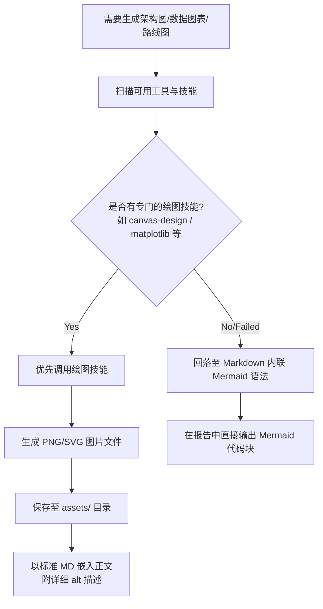
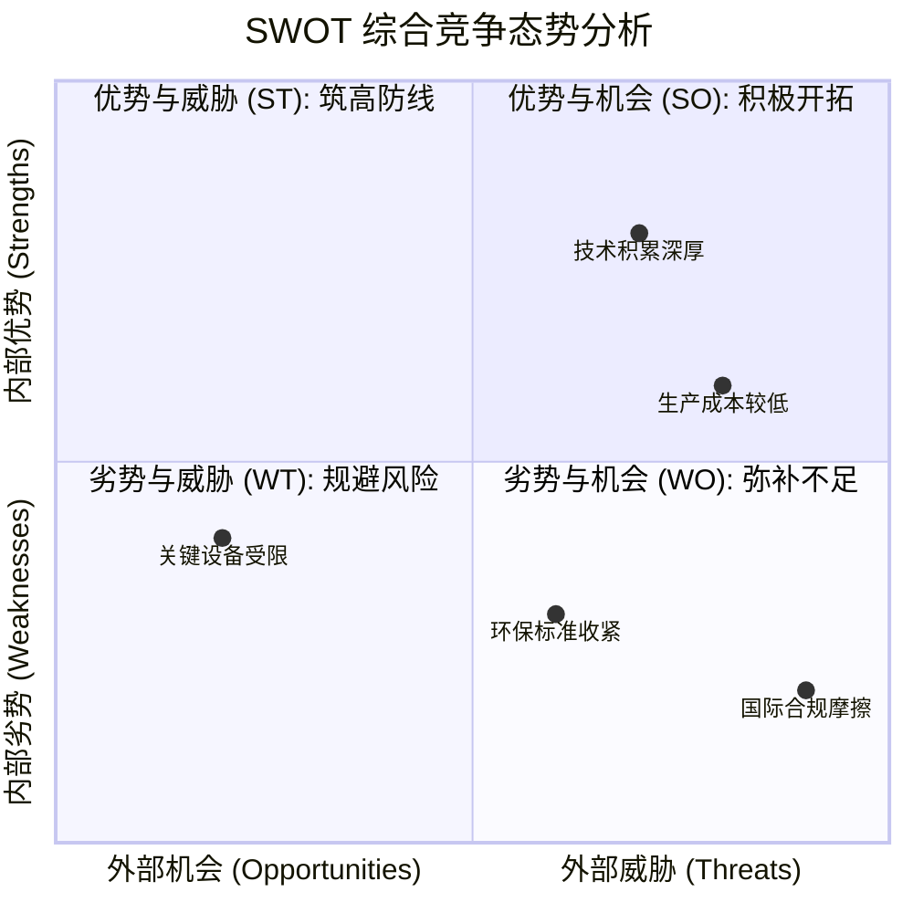
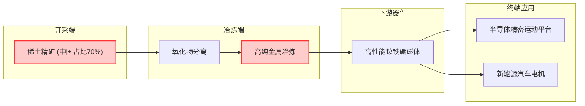
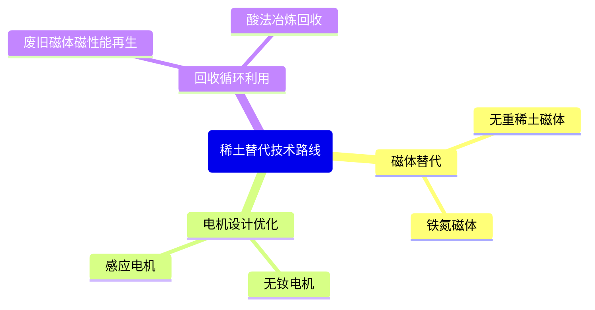

# Deep Research 数据可视化与绘图回落指南

为了将研究报告中的数据、趋势与复杂关系清晰呈现，Lead Agent 必须引入高质量的数据可视化图表。本指南规定了可视化图表的“工具发现与回落（Fallback）机制”以及 Mermaid 语法规范。

## 1. 绘图与可视化回落机制 (Diagram Fallback Policy)

在生成图表时，Lead Agent 必须遵循以下两级调用与回落策略：



### 1.1 优先级 1：专用绘图技能与本地化管理
1. **技能检索**：检查当前环境中注册的绘图技能（如 `canvas-design`、`algorithmic-art`）或 Python 绘图库（`matplotlib`、`seaborn`）。
2. **生成与保存**：调用该技能/代码，输入数据或结构，生成高精度的图片文件（PNG/SVG）。
3. **本地化归档**：将生成的图片移动至项目根目录下的 `assets/`，例如 `assets/chart_swot_analysis.png`。
4. **正文嵌入**：在报告正文中使用标准的图片嵌入格式：
   ```markdown
   !["[详尽的图表数据和趋势解析描述，供下游 LLM 理解该图表]"](assets/chart_swot_analysis.png "SWOT 综合分析图")
   ```

### 1.2 优先级 2：Mermaid 内联代码块回落
若无可用的专用绘图技能，或调用执行失败，则必须回落为直接在 Markdown 报告中输出 Mermaid 代码块。

---

## 2. Mermaid 语法防错校验指南 (Anti-Error Guidelines)

Mermaid 解析器非常敏感，任何语法微瑕都会导致整张图渲染失败。在输出 Mermaid 代码块时，必须严格遵守以下防错规则：

### ⚠️ 规则 1：复杂文本必须用双引号包裹
节点文本如果包含空格、括号、标点符号、中文等，**必须**使用双引号包裹，否则解析会直接崩溃。
- ❌ **错误**：`A[全球中重稀土 (中国占比89%)] --> B`
- ✅ **正确**：`A["全球中重稀土 (中国占比89%)"] --> B`

### ⚠️ 规则 2：节点 ID 必须简单且唯一
节点 ID 应使用简单的英文字母或数字（如 `A`, `B`, `step1`），不要在 ID 中使用中文或特殊符号。
- ❌ **错误**：`中国稀土 --> 冶炼环节`
- ✅ **正确**：`china["中国稀土"] --> process["冶炼环节"]`

### ⚠️ 规则 3：严格禁止包含任何 HTML 标签
虽然某些渲染器支持 HTML，但为了最大化兼容性，不要在节点文本中直接使用 `<br>`、`<b>` 或 `<div>` 标签。
- ❌ **错误**：`A["第一阶段<br>原材料输入"]`
- ✅ **正确**：在 Mermaid 节点定义中通过换行或双引号分行描述，或者直接保持文本简洁。

---

## 3. 典型调研分析 Mermaid 模板

在回落为内联 Mermaid 时，针对不同的调研版块，请直接套用以下标准结构模板：

### 3.1 SWOT 象限图 (SWOT Quadrant Chart)


### 3.2 产业链/供应链流向图 (Supply Chain Flowchart)


### 3.3 竞争格局脑图 (Competitive Landscape Mindmap)

