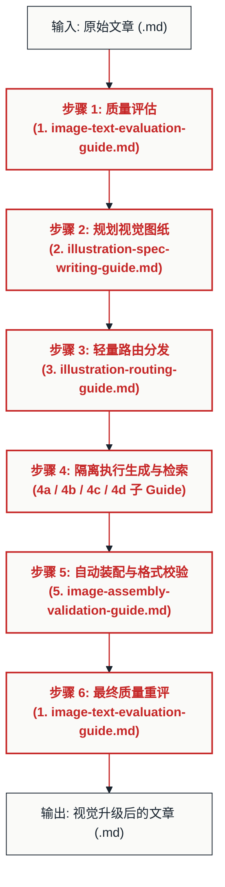

# 🎨 Markdown 文章自动配图与装配管线 (Markdown Illustrator Pipeline)

本技能定义了为 Markdown 文章进行全自动、高审美、结构化配图与智能装配的 **6 步闭环管线 (6-Step Pipeline)**。

当用户提供了一篇 Markdown 文章（或指明其路径），并希望“为文章配图”、“优化视觉表现”、“进行精美排版”时，你必须严格按照本规范组织和调用 `guides/` 目录下的各个步骤指南。

---

## 🛠️ 全流程管线概览 (Pipeline Overview)



---

## 📖 6-Step 详细执行指南

### 步骤 0：环境依赖前置自检 (Dependency Check)
*   **动作**：在正式运行管线之前，检查技能根目录下是否已安装 NPM 依赖。若没有，请在后台运行 `npm install` 安装 `resvg-js`, `jsdom`, `dompurify` 等必要库，确保后续脚本能够正常执行。

### 步骤 1：质量评估与现状诊断 (Diagnosis)
*   **指令**：加载并执行 [1. image-text-evaluation-guide.md](guides/1.%20image-text-evaluation-guide.md)。
*   **动作**：分析输入的 Markdown 文章，按照“图文匹配度”、“配图密度”、“图表类型多样性”等维度给出 1~5 分的现状打分。
*   **退场条件**：如果打分为 5 分（已经非常完美，图表及排版无懈可击），直接向用户报告评估结果并结束管线，避免过度设计。如果低于 5 分，进入下一步。

### 步骤 2：规划视觉图纸 (Planning Spec)
*   **指令**：加载并执行 [2. illustration-spec-writing-guide.md](guides/2.%20illustration-spec-writing-guide.md)。
*   **动作**：
    1.  进行三维解耦推导（发布平台、内容领域、号设身份），拟定视觉流派与三色盘。
    2.  **暂停并与用户交互确认**（询问流派、色盘推荐和保存位置）。
    3.  确认后，读取对应的 palettes 和 styles 规范，定位文章的配图插槽 `📌 [位置 N]`。
    4.  生成并保存文章专属的规划清单：`[原文章名].plan.md`。

### 步骤 3：轻量路由分发 (Routing)
*   **指令**：加载并执行 [3. illustration-routing-guide.md](guides/3.%20illustration-routing-guide.md)。
*   **动作**：遍历 `[原文章名].plan.md` 中的每个配图插槽，识别其“配图类型”，决定其分发路径（路径 1 ~ 4），并准备依次加载对应的子 Guide 运行。

### 步骤 4：隔离执行生成与检索 (Generation / Retrieval)
*   **动作**：对于每一个分流节点，加载对应的专属指南，在相互隔离的上下文中生成或检索图片：
    *   **路径 1 (结构化图表)**：加载 [4b. mermaid-diagram-writing-guide.md](guides/4b.%20mermaid-diagram-writing-guide.md)，产出 `.mmd`。
    *   **路径 2 (矢量知识卡片)**：加载 [4c. svg-card-writing-guide.md](guides/4c.%20svg-card-writing-guide.md)，产出 `.svg`。
    *   **路径 3 (生成式插画)**：加载 [4a. ai-image-generation-guide.md](guides/4a.%20ai-image-generation-guide.md)，使用 Moonvy 提示词公式并调用绘图工具，产出 `.png`。
    *   **路径 4 (真实媒体检索)**：加载 [4d. media-search-retrieval-guide.md](guides/4d.%20media-search-retrieval-guide.md)。该步骤会执行本地资产收割脚本：
        ```bash
        npx tsx scripts/harvest-assets.ts <工作区目录> <目标文章绝对路径> <关键词> <原文章名>.cand.md
        ```
        并同时执行网络检索，经过多模态视觉质检和证据级别对比，决定最终选用。
*   **输出数据契约**：所有子 Guide 运行结束后，必须将最终结果以统一的单行标准格式追加写入到 `[原文章名].cand.md` 注册清单中：
    ```markdown
    <建议插入行号>: 
    ```

### 步骤 5：自动装配与格式校验 (Assembly & Validation)
*   **指令**：加载并执行 [5. image-assembly-validation-guide.md](guides/5.%20image-assembly-validation-guide.md)。
*   **动作**：
    1.  读取 `[原文章名].cand.md`，执行 **自底向上装配算法**，把配图代码批量插入到主文档对应行号下，避免行号漂移。
    2.  执行格式校验：扫描正文的 `.mmd` 引用，调用 `mermaid-cli`（`mmdc`）一键编译为 `.png`，并同步更新正文后缀。
    3.  执行物理文件存在性与双轨制 Alt 合规性校验，输出校验报告。

### 步骤 6：最终质量重评 (Re-evaluation)
*   **指令**：重新加载并执行 [1. image-text-evaluation-guide.md](guides/1.%20image-text-evaluation-guide.md)。
*   **动作**：对装配完图片的文章进行二次打分，并将配图前后的分数与维度评估进行对比，在会话中向用户呈递最终升级报告。

---

## 🧠 经验沉淀与问题记录 (Learnings & Continuous Improvement)

在执行本管线过程中的任何阶段，如果遇到**报错、渲染失败、语法不兼容或其它意外问题**：
1. 请先尝试根据现有的文档和上下文信息**解决问题**。
2. 当问题被成功解决后，**你必须主动将问题表象、产生原因以及最终的解决办法/操作步骤**，以追加（Append）的方式记录到技能根目录下的 `learnings.md` 文件中。
3. 这样可以确保本技能在持续使用中不断积累经验，避免未来重复踩坑。

---

## 📂 目录结构与资源关系

请确保你在调用脚本或查找文件时，遵循以下固定的目录布局关系：

```
markdown-illustrator/
├── SKILL.md (本文件，管线总控)
├── guides/   (6 步步骤指南文件)
│   ├── 1. image-text-evaluation-guide.md
│   ├── 2. illustration-spec-writing-guide.md
│   ├── 3. illustration-routing-guide.md
│   ├── 4a. ai-image-generation-guide.md
│   ├── 4b. mermaid-diagram-writing-guide.md
│   ├── 4c. svg-card-writing-guide.md
│   ├── 4d. media-search-retrieval-guide.md
│   └── 5. image-assembly-validation-guide.md
├── scripts/  (自动化执行脚本)
│   └── harvest-assets.ts
├── references/ (全局视觉与画布预设规范)
│   ├── canvas/   - 社交平台安全区域与尺寸规格
│   ├── palettes/ - 标准视觉色票模板
│   └── styles/   - 艺术流派与美学设计要素
└── learnings.md
```

---

## 🏁 下一步指引 (Pipeline Handoff)

执行此技能时，建议优先通过命令行调用或自动化任务管理。一旦你接收到待配图文章，请立刻向用户反馈步骤 1 的现状诊断打分，并询问是否启动步骤 2 的视觉图纸规划。

当整个 `markdown-illustrator` 管线执行完毕并输出最终升级报告后，考虑向用户推荐以下后续技能或动作：
*   **文章排版与语法优化**：如果文章用于公开发表，建议运行 `pretty-markdown`（如果可用）进行中英文排版优化。
*   **格式导出**：如果用户需要在会议中演示，建议将 Markdown 转换为 PDF 或 PPTX。
*   **人工校验**：提醒用户检查最终的 Markdown 文档，确认所有插图（特别是 Mermaid 图表与 SVG 卡片）渲染符合预期。
