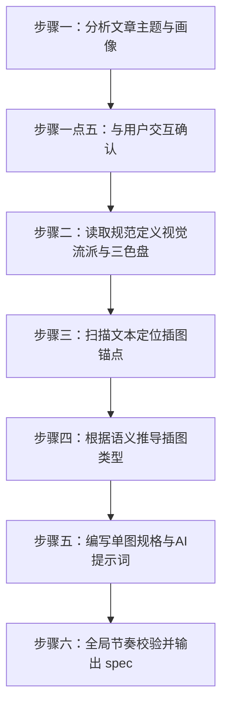

# 🎨 视觉配图基调编写指南 (Illustration Spec Writing Guide)

本指南旨在指导 AI Agent 或排版编辑通过系统化的分析方法，针对输入的任意 Markdown 原文，逐步分析、推导并输出该文章的 `[文件名].plan.md` 视觉图纸。

---

## 🛠️ 执行步骤概览



---

## 📖 详细步骤指导

### 步骤一：分析文章主题与画像 (Article Profiling)
*   **动作**：通读全文，提取核心关键词、文章品类和目标发布平台。
*   **三维解耦推导规则 (Decoupled Deciding Rules)**：
    为防止平台与视觉风格过度耦合导致配图千篇一律，必须通过以下三个独立维度进行视觉推导：
    1.  **发布平台（提供物理规格建议，非强制）**：
        根据目标发布平台的通用规范给出建议尺寸和体积参数，但不做强行约束，允许在交互确认（步骤1.5）中由用户或子Agent进行自定义重写：
        *   *微信公众号（建议规格）*：头图 `900x383` (核心安全区 `383x383` 居中)，正文图建议 `16:9` 横图，单图体积上限建议 $5\text{MB}$。
        *   *小红书/Instagram（建议规格）*：正文图建议竖图 `3:4` 或方图 `1:1`，以静态高保真图为主。
        *   *Twitter/X/Medium（建议规格）*：卡片比例建议 `1.91:1`，正文建议 `16:9`。
    2.  **内容领域（决定艺术流派与风格）**：
        *   *理科/硬核技术类* $\rightarrow$ 映射到 **极简线框风 (Line Art / Minimalist)** 或 **Notion 手绘黑白风**，侧重逻辑图表。
        *   *文科/情感人文类* $\rightarrow$ 映射到 **治愈系手绘风 (Cozy Hand-drawn)** 或 **水彩艺术 (Watercolor)**，侧重情感修饰图。
        *   *商业分析/行业报告* $\rightarrow$ 映射到 **现代扁平商务风 (Modern Corporate Flat)**，侧重数据图表。
        *   *年轻化/前沿概念类* $\rightarrow$ 映射到 **3D 黏土拟物风 (3D Clay Render)**，侧重概念氛围图。
    3.  **品牌/号设身份（决定基准色盘与Logo）**：
        *   从品牌数据库读取或向用户推荐与之调性相符的色彩体系（如严肃写作推荐墨香古风，新潮媒体推荐霓虹赛博），决定后续生成图表和卡片时的 Hex 色盘基底。

---

### 步骤一点五：与用户交互确认 (User Confirmation & Interactive Selection)
*   **动作**：Agent 必须在这一步暂停，主动与用户对齐上述的解耦设定。推荐调用 `ask_question` 工具进行确认。
*   **交互规则**：
    1.  **风格方案确认**：展示步骤一推导的“内容领域 $\rightarrow$ 艺术流派”匹配方案，读取 `references/styles/` 下的样式模板，提供多选/单选供用户确认。
    2.  **配色方案确认**：基于用户或品牌调性，从 `references/palettes/` 中检索并向用户推荐色盘选项（如 暖色系、马卡龙色系、霓虹炫彩系等）。
    3.  **保存位置确认**：提示即将生成的 `[文件名].plan.md` 规范文件默认路径（通常为与文章原文同名并同级目录下），询问用户是否需要自定义。
    4.  **安全阀控制**：只有在用户确认并提交选项后，Agent 才能根据反馈读取相应的参考文件并进入步骤二。

---

### 步骤二：读取规范定义视觉流派与三色盘 (Style & Palette Specification)
*   **动作**：根据步骤一点五中用户最终确定的流派与色盘配置文件（对应 `references/` 下的具体 Markdown 模板），确立整篇文章的视觉风格基调与色彩空间。
*   **推导规则**：
    1.  **引入选定的 Style 模板**：读取选定样式模板（如 `notion.md`）中的 `Design Aesthetic` 以及 `Do's & Don'ts`，作为后续绘图 Agent 生成图片时的系统约束。
    2.  **引入选定的 Palette 模板**：读取选定色盘模板（如 `mono-ink.md`）中的 HEX 颜色值（主色 Primary、辅助色 Secondary、点缀色 Accent、背景色 Background），将色值硬性写入到对应的插图规划中，确保全篇色彩高度统一。

---

### 步骤三：扫描文本定位插图锚点 (Anchoring Insertion Points)
*   **动作**：按物理节奏在 Markdown 中圈定建议插入图片的位置。
*   **判定标准（三段一图原则）**：
    1.  **大标题下方**：每个二级标题（H2）下方一般为首选插图点（若紧接着有 H3，则在 H3 下方）。
    2.  **段落密集度**：连续纯文本段落超过 $3 \sim 4$ 段（移动端显示约 1~2 屏），且字数达到 $400 \sim 500$ 字时，强制规划一个插图锚点以供视觉喘息。
    3.  **大景别主图**：在 H1 标题正下方（或 YAML Frontmatter 中）强制规划一个**封面头图 (Cover)** 锚点。

---

### 步骤四：根据语义推导插图类型 (Type Inference)
*   **动作**：针对步骤三锁定的每一个锚点，分析其前后 2 个自然段的“语言特征”，推导出最合适的配图类型。
*   **推导逻辑**：
    *   *特征 A：有数据、对比、趋势变化* $\rightarrow$ **数据图表 (Charts)** (路径 1)
    *   *特征 B：有步骤、因果、结构体系、生命周期* $\rightarrow$ **流程图/逻辑图 (Flowcharts / Mindmaps)** (路径 1)
    *   *特征 C：有情感金句、定义、核心公式、大咖语录* $\rightarrow$ **矢量版式知识卡片 (Layout Cards)** (路径 2)
    *   *特征 D：无强逻辑或数据，但段落长，话题即将发生转折* $\rightarrow$ **艺术氛围修饰图 (Decorative Illustrations)** (路径 3)
    *   *特征 E：属于纪实证据、系统运行截图、新闻现场实拍等需要真实性佐证的内容。或当前文章是从某个已有本地 MD/互联网新闻总结、改写而来。* $\rightarrow$ **真实纪实与系统快照 (Reality & Retrieval/Snapshot)** (路径 4)

---

### 步骤五：编写单图规格与设计提示词 (Detailing & Prompting)
*   **动作**：为每一个确定的插图锚点撰写具体的设计需求。
*   **包含要素**：
    1.  **图片类型**：路径 1 (Mermaid) / 路径 2 (SVG) / 路径 3 (Gen-AI) / 路径 4 (Reality/Retrieval/Snapshot)。
    2.  **画面详细内容描述**：图片要画什么（如：“一张折线图展示从 2020 到 2026 的增长” 或 “一个戴眼镜的研究员正在使用显微镜的插画”）。
    3.  **色彩规范应用**：明确指定使用哪几个 HEX 颜色值。
    4.  **技术参数/代码模板**：
        *   若是 *路径 1 (Mermaid)*：说明首选图表类型（如 `graph TD` 或 `pie`）。
        *   若是 *路径 2 (SVG)*：写明卡片文字提取的范围与排版模板类型。
        *   若是 *路径 3 (Gen-AI)*：自动输出包含视觉风格前缀、画面主体和全局主色的 English Prompt。
        *   若是 *路径 4 (Reality/Retrieval/Snapshot)*，根据具体子渠道声明：
            *   **源文关联检索渠道 (Retrieval)**：指明源本地 MD 路径或源互联网网页 URL，要求 Agent 搜索对应上下文附近的图片 URL，下载并拷贝（如 `source_ref: "origin_article.md#L45"` 或 `url_ref: "https://news.com/xxx"`）。
            *   **系统快照渠道 (Screenshot)**：提供截图目标 URL 以及可能需要的 Puppeteer 交互选择器。
            *   **本地资产注入渠道 (Manual)**：指明预置占位文件名，要求人工将现场实拍照移入该路径。

---

### 步骤六：全局节奏校验并输出规范文档 (Rhythm Verification & Output)
*   **动作**：全局总览已规划的所有配图，核对视觉连续性。
*   **校验清单**：
    *   [ ] 封面头图核心元素是否已声明居中安全区？
    *   [ ] 全局三色盘色值是否在后续的每一张单图规划中被严格复用？
    *   [ ] 是否存在连续两张强认知负载的逻辑图表？（如有，需将其中一张调整为卡片图或氛围图）
    *   [ ] 所有配图是否严格统一了比例（统一为 16:9 横图或长图）？
*   **输出**：在目标文章的同级目录下生成名为 `[文章文件名].plan.md` 的规范文件（格式严格参考附录）。

---

## 📄 附录：智能体输出目标格式模板 (`[文件名].plan.md` 格式规范)

当你执行完毕后，生成的 `[文件名].plan.md` 必须严格包含以下 Markdown 格式：

```markdown
# 🎨 文章视觉基调与配图规范清单 (Visual Style Specification)

## 📌 一、 基础元数据 (Metadata)
*   **文章标题**：[标题]
*   **目标平台**：[平台名称]
*   **视觉主调性**：[主观视觉风格定义]

## 🎨 二、 全局视觉风格与色盘 (Style & Palette)
*   **选定流派**：[流派名称，例如：扁平矢量/3D黏土/手绘]
*   **主色 (Primary)**：`#HEX`
*   **辅助色 (Secondary)**：`#HEX`
*   **点缀色 (Accent)**：`#HEX`
*   **底色 (Background)**：`#HEX`

## 📊 三、 配图节奏与容量预算 (Rhythm & Budget)
*   **文章总字数**：[字数]
*   **配图总数量**：[数量]

## 📝 四、 局部配图节点规划 (Image Insertion Points Plan)

### 📌 [位置 1]：封面头图 (Cover)
*   **位置描述**：H1标题正下方
*   **配图类型**：路径 3 - 生成式艺术
*   **内容描述**：[详细的主体与构图描述]
*   **配色应用**：背景 `#HEX`，核心主体采用主色 `#HEX` 和点缀色 `#HEX`。
*   **AI Prompt**：`[AI绘图提示词，用英文描述]`

### 📌 [位置 2]：正文插图 [序号]
*   **位置描述**：第 X 段后，引出文本 "[相关段落前 10 个字...]"
*   **配图类型**：[路径 1-结构化图 / 路径 2-矢量图 / 路径 3-生成图 / 路径 4-检索/快照图]
*   **内容描述**：[详细画面承载的文字与图表逻辑]
*   **配色应用**：[配色说明]
*   **AI Prompt / Mermaid类型 / 卡片提取文字 / 图片URL**：`[相应的具体生成参数]`

······

### 📌 [位置 N]：文末插图 [序号]
*   **位置描述**：第 X 段后，引出文本 "[相关段落前 10 个字...]"
*   **配图类型**：[路径 1-结构化图 / 路径 2-矢量图 / 路径 3-生成图 / 路径 4-检索/快照图]
*   **内容描述**：[详细画面承载的文字与图表逻辑]
*   **配色应用**：[配色说明]
*   **AI Prompt / Mermaid类型 / 卡片提取文字 / 图片URL**：`[相应的具体生成参数]`
```
