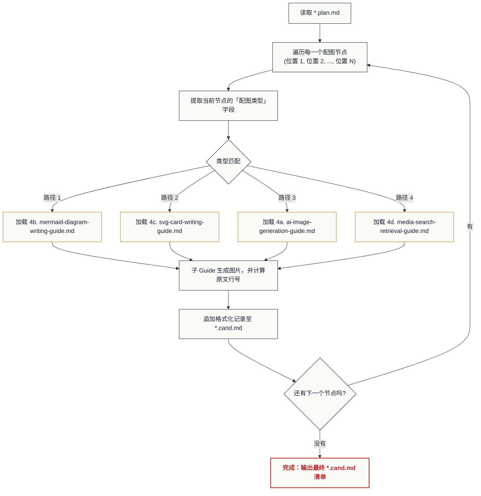

# 🚦 插图路由分发指南 (Illustration Routing Guide)

本指南作为配图工作流的**中央分发器 (Dispatcher)**，唯一职责是：

> 遍历 `*.plan.md` 中的每一个配图节点，识别其**配图类型**，加载对应的子 Guide。

本指南不做渲染、不做编译、不做风格校验——这些全部由被加载的子 Guide 各自负责。

---

## 🛠️ 执行流程



---

## 📤 输出数据契约与下游衔接

由于子 Guide 运行在相互隔离的上下文中，为了将所有配图产出安全地传递给后续步骤（步骤 4/5），必须遵循统一的输出契约：

1. **统一注册表 (`*.cand.md`)**：每一个子 Guide 在为节点生成好物理图片或检索到热链后，必须在原始文章所在的同级目录下，向 `[原文章名].cand.md` 写入一行标准化记录：
   ```markdown
   <行号>: 
   ```
2. **自底向上装配与校验**：生成流程全部结束后，路由流程即告完成。接下来将加载 [5. image-assembly-validation-guide.md](5.%20image-assembly-validation-guide.md) 进行：
   - 步骤 4：自底向上解析行号并插入正文。
   - 步骤 5：对 `.mmd` 执行 Mermaid 编译、物理图片存在性与双轨制 Alt 合规性校验。

---

## 📋 四路方案速查表

下表定义了四条路径的**适用场景**、**核心特点**和**对应子 Guide**，Agent 在分发时必须以 `*.plan.md` 中每个节点的「**配图类型**」字段为唯一判定依据。

### 路径 1 — 结构化图表 (Mermaid)

| 维度 | 说明 |
| :--- | :--- |
| **对应子 Guide** | `4b. mermaid-diagram-writing-guide.md` |
| **适用场景** | 段落含有**数据对比、趋势变化、步骤流程、因果关系、结构层级、时间线、决策分支**等可被结构化表达的信息 |
| **核心特点** | 使用 Mermaid 源码（`.mmd`）绘制逻辑图表，支持 11 种图表类型（流程图、时序图、甘特图、桑基图、思维导图等）。必须读取 Spec 中的全局色盘写入 `classDef`，确保配色统一 |
| **产出物** | `.mmd` 源码文件 + 带有详细 Alt 描述的 Markdown 图片引用 |
| **识别关键词** | `路径 1`、`Mermaid`、`结构化图表`、`流程图`、`逻辑图`、`时序图`、`甘特图` |

### 路径 2 — 矢量版式知识卡片 (SVG)

| 维度 | 说明 |
| :--- | :--- |
| **对应子 Guide** | `4c. svg-card-writing-guide.md` |
| **适用场景** | 段落含有**情感金句、核心定义、方法论对比、语录引用、要点清单**等适合以精美排版展示的文本内容 |
| **核心特点** | 使用 SVG + `<foreignObject>` 内嵌 HTML/CSS 排版，支持杂志封面风、瑞士列表卡、分享海报等模板。必须从 `references/palettes/` 和 `references/styles/` 读取品牌色盘与流派规范 |
| **产出物** | `.svg` 卡片文件 + 带有详细 Alt 描述的 Markdown 图片引用 |
| **识别关键词** | `路径 2`、`SVG`、`知识卡片`、`Layout Card`、`版式卡片` |

### 路径 3 — 生成式艺术 / 创意插画 (AI Image Generation)

| 维度 | 说明 |
| :--- | :--- |
| **对应子 Guide** | `4a. ai-image-generation-guide.md` |
| **适用场景** | 段落**无强逻辑或结构化数据**，话题即将发生转折，需要一张**氛围修饰图**来调节阅读节奏；或需要为文章生成**封面头图、概念插画、宣传海报**等创意视觉 |
| **核心特点** | 调用 Agent 平台自带的图像生成工具（如 `generate_image`），输入 Spec 中预写的 English AI Prompt。Prompt 中应包含 Spec 定义的视觉风格前缀与全局主色 |
| **产出物** | `.png` 图片文件 + 带有详细 Alt 描述的 Markdown 图片引用 |
| **识别关键词** | `路径 3`、`Gen-AI`、`生成式艺术`、`AI Prompt`、`氛围图`、`修饰图`、`插画`、`封面` |

### 路径 4 — 真实纪实 / 媒体素材检索 (Media Search & Retrieval)

| 维度 | 说明 |
| :--- | :--- |
| **对应子 Guide** | `4d. media-search-retrieval-guide.md` |
| **适用场景** | 段落属于**纪实证据、新闻现场、时政信息、系统运行截图**等需要真实性佐证的内容，或当前文章是从某个已有本地 MD / 互联网新闻改写而来 |
| **核心特点** | 通过本地资产池模糊匹配与网络事实检索两条渠道获取真实图片。本地匹配使用 TS 脚本跨工作区检索；网络检索从官方媒体抓取新闻大图并进行多模态视觉核验。可采用远程热链（Hotlink），无需下载物理文件 |
| **产出物** | 本地图片复制件 或 远程 URL 热链 + 带有事实元数据 Alt 描述的 Markdown 图片引用 |
| **识别关键词** | `路径 4`、`Reality`、`Retrieval`、`Snapshot`、`纪实`、`新闻`、`截图`、`素材检索` |

---

## 📐 类型匹配规则

Agent 在解析 `*.plan.md` 的每一个 `### 📌 [位置 N]` 节点时，按以下顺序提取并判定：

1. **读取「配图类型」字段**：该字段的值即为路由判定的唯一输入。
2. **关键词匹配**：将字段值与上方速查表中每条路径的「识别关键词」进行匹配。
3. **加载对应子 Guide**：匹配成功后，将该节点的完整信息（位置描述、内容描述、配色应用、技术参数）传递给子 Guide 执行。

### 匹配示例（以 `2024年全国两会...plan.md` 为例）

| 配图节点 | 「配图类型」原文 | 匹配路径 | 加载的子 Guide |
| :--- | :--- | :--- | :--- |
| 位置 1：封面头图 | `路径 3 - 生成式艺术` | 路径 3 | `4a. ai-image-generation-guide.md` |
| 位置 2：4类群体分类图 | `路径 1 - 结构化图表 (Mermaid)` | 路径 1 | `4b. mermaid-diagram-writing-guide.md` |
| 位置 3：领导干部对比卡 | `路径 2 - 矢量版式知识卡片 (SVG Layout Card)` | 路径 2 | `4c. svg-card-writing-guide.md` |
| 位置 4：基层创新卡 | `路径 2 - 矢量版式知识卡片 (SVG Layout Card)` | 路径 2 | `4c. svg-card-writing-guide.md` |
| 位置 5：全景贯彻流程图 | `路径 1 - 结构化图表 (Mermaid)` | 路径 1 | `4b. mermaid-diagram-writing-guide.md` |

---

## ⚠️ 异常处理

*   **无法匹配**：若「配图类型」字段的值无法与任何路径匹配（例如拼写错误或使用了未定义的路径编号），Agent 必须暂停并向用户报告该节点的原始字段值，请求人工确认后再继续。
*   **子 Guide 尚未创建**：若匹配到的子 Guide 文件在磁盘上不存在（例如 `4a. ai-image-generation-guide.md` 尚未编写），Agent 必须向用户报告该依赖缺失，并跳过该节点继续处理剩余节点，最终在汇总报告中列出所有被跳过的节点。
