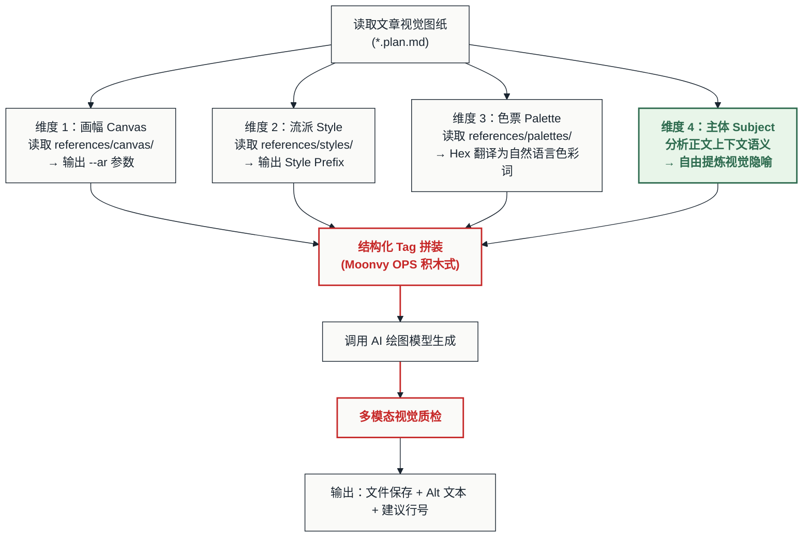
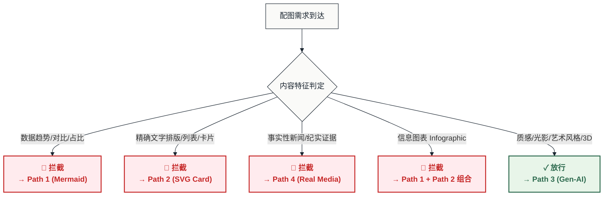

# 🎨 AI 生成图片提示词组装与质量控制指南 (AI Image Generation Guide)

## 📌 核心使命

本模块规范 **路径 3 — 生成式艺术 (Gen-AI Illustration)** 在四轨配图体系中的生态位与执行标准。

> **Gen-AI 的核心价值不在于"万能"，而在于"不可替代"。**

它唯一且不可替代的能力是生成 **光影质感、真实摄影、3D 拟物、艺术风格渲染** 等其他三条路径（Mermaid / SVG / Real Media）在技术上无法实现的视觉效果。与此同时，它有三个不可忽视的物理边界：

1. **生成延迟与成本高**：每次请求数十秒至数分钟，API 消耗昂贵。
2. **非矢量化（不可编辑性）**：输出 PNG/JPG 像素图无法自由缩放，文字无法选中、搜索或翻译。
3. **"AI 乱码"硬伤**：复杂文字排版极易产生拼写扭曲或天书乱码。

因此，本指南的核心任务是：**让 Agent 像搭积木一样拼装出高度可控、风格统一的英文 Prompt，同时明确 Gen-AI 的生态位边界与其他三条路径的协同规则。**

---

## 📂 一、 四维解耦控制模型 (Decoupled Control Architecture)

将一次 AI 图像生成拆解为四个独立控制维度。前三个维度通过读取 `references/` 下的规范文件进行**硬性约束**，仅第四个维度留给 Agent **自由发挥**：



### 各维度约束级别与数据源

| 维度 | 约束级别 | 数据来源 | 输出形式 |
| :--- | :--- | :--- | :--- |
| **画幅 (Canvas)** | **强约束** | `references/canvas/` | `--ar 16:9` / `--ar 3:4` 等 |
| **流派 (Style)** | **强约束** | `references/styles/` | 英文 Style Prefix 前缀词组 |
| **色票 (Palette)** | **软约束** | `references/palettes/` | Hex → 自然语言色彩描述 |
| **主体 (Subject)** | **完全自由** | 正文上下文语义提取 | 核心概念 / 人物 / 隐喻动作 |

---

## 📂 二、 提示词组装与色票映射规则 (Prompt Assembly & Palette Mapping)

由于这部分逻辑包含长篇的映射对照表与结构化提示词模版，为保证本指南精简，请**强制读取并应用**以下外部规范文件：

> **👉 请立即读取：[references/moonvy-prompt-formula.md](../references/moonvy-prompt-formula.md)**

该规范文件中包含了：
1. **Moonvy OPS 结构化 Tag 拼装公式**（严禁写冗长自然语言句子）。
2. **色票自然语言映射规则**（必须将 Hex 转换为英文具象色彩描述）。
3. **视觉双重曝光叠加方案**（AI 与 SVG 的分工规则）。
4. **五大提示词模版库**（直接套用填空）。

**在完成外部规则的读取后，再继续执行下方第六节的负向约束。**

---

## 📂 六、 负向提示词硬约束 — 防崩安全阀 (Negative Prompt Safety Valves)

AI 绘图容易产生视觉噪声。Agent 在生成**任何**提示词时，必须强制附加以下负向词组：

### 1. 通用强制注入（所有场景必须包含）

```
--no low quality, blurry, watermark, signature, bad anatomy, deformed
```

### 2. 防文字乱码（除非 Spec 明确要求嵌入英文短词）

```
--no text, words, writing, letters, gibberish, labels, captions, font, typography
```

> [!WARNING]
> **防文字乱码是最高优先级的负向约束**。AI 模型生成的中文字和复杂英文段落几乎 100% 会出现乱码或拼写错误。
> 任何需要精确文字的场景，必须路由至 Path 2 (SVG Card) 或采用"视觉双重曝光"方案（第四节）。

### 3. 防多余边框（网页/文档内嵌插图）

```
--no frame, border, device mockup, laptop screen, phone screen
```

### 4. 风格冲突防护（根据选定流派动态附加）

| 选定流派 | 额外附加的负向词 |
| :--- | :--- |
| `notion` / `minimal` | `--no realistic, photo, shading, gradients, complex details` |
| `flat` | `--no shadows, depth, gradients, textures, photographic` |
| `photorealistic` | `--no illustration, cartoon, drawing, vector, flat design` |
| `3d-clay` | `--no metallic, glass, sharp edges, realistic, flat 2D` |
| `watercolor` | `--no sharp edges, digital, geometric, photographic` |

---

## 📂 七、 路由拦截与重定向规则 (Routing Interception)

以下场景 **严禁使用 Gen-AI**，Agent 必须拦截请求并路由至其他路径：



### 拦截决策表

| 场景 | 拦截原因 | 重定向至 |
| :--- | :--- | :--- |
| **精确数据/图表**（折线、柱状、饼图、趋势） | AI 无法保证数据准确性 | Path 1 (Mermaid) |
| **可编辑文字排版**（标题、列表、金句卡片） | AI 输出像素图不可编辑且文字乱码 | Path 2 (SVG Card) |
| **事实性新闻/纪实照片** | AI 生成的"假照片"缺乏可信度 | Path 4 (Real Media) |
| **信息图表 (Infographic)** | 需要精确文字 + 精确图表双重需求 | Path 1 + Path 2 组合 |
| **系统截图 / UI 展示** | 需要真实界面，AI 生成的 UI 必然失真 | Path 4 (Screenshot) |

> [!CAUTION]
> **绝对禁止使用 Gen-AI 生成事实性证据图片**。AI 生成的"新闻照片"从外观上可能以假乱真，但它从未在现实世界中发生——这构成虚假信息。
> 任何需要以真实性、可信度佐证正文的配图，必须路由至 Path 4 (Real Media)。

---

## 📂 八、 多模态视觉质检协议 (Multimodal Vision Inspection)

Agent 生成图片后，**必须使用多模态大模型的"图片阅读/视觉感知"功能**传入生成的图片进行审查。质检重点是 **"防崩与防穿帮"**：

### 质检核对清单

```
[ ] 文字乱码检查：画面中是否存在任何不可读的文字、字母或符号？
[ ] 肢体变形检查：人物手指数量是否正确？是否存在多余/缺失的肢体？
[ ] 色调一致性：画面主色调是否与 Spec 色票一致？是否出现了色盘以外的突兀色彩？
[ ] 安全区检查：构图主体是否位于画布安全区内？（微信封面须确认核心元素在中央 383×383 区域）
[ ] 水印/Logo 检查：画面边缘是否存在商业素材网水印或第三方 Logo？
[ ] 风格一致性：图片渲染风格是否与 Spec 选定的流派一致？（如选定 flat 风格，是否出现了写实阴影？）
[ ] 视觉噪声：是否存在广告 Banner、不可解释的乱码元素、或明显的 AI 伪影（artifact）？
```

> [!IMPORTANT]
> 如果质检发现**文字乱码或肢体变形**，不要尝试用同一 Prompt 反复重试。应当：
> 1. 在负向词中加强对应约束（如 `--no extra fingers, deformed hands`）；
> 2. 微调 Prompt 主体描述，减少容易引发变形的元素（如减少多人场景、复杂手势）；
> 3. 若文字需求不可避免，则路由至"视觉双重曝光"方案（第四节）。

---

## 📂 九、 文件命名、保存与交付规范 (File Naming & Delivery)

### 1. 文件格式与保存路径

*   **格式**：PNG（通用）或 JPG（摄影类、体积敏感场景）。不保存为 SVG。
*   **保存路径**：默认保存在正文同级目录下的 `./images/` 中。
*   **体积控制**：单张不超过 $5\text{MB}$，整篇文章所有图片总容量不超过 $10\text{MB}$。

### 2. 文件命名规范

遵循三段式自解释命名：

```
[article-slug]-[content-focus]-genai.[ext]
```

*   **`[article-slug]`**：文章主题的短英文或拼音缩写。
*   **`[content-focus]`**：该图片承载的具体内容重心或隐喻焦点。
*   **`genai`**：标识此图片由 AI 生成（与 Mermaid 的 `-chart.mmd` 和 SVG 的 `-card.svg` 区分）。

**示例**：
*   ✓ `ai-tools-workflow-dimensional-reduction-genai.png`
*   ✓ `lh-learning-party-members-study-atmosphere-genai.jpg`
*   ❌ `cover.png`（通用化，禁止使用）

### 3. 交付输出规范 (统一 I/O 契约)

图片生成完毕后，**不要修改用户的正文 MD 文件**。Agent 必须将产出结果以单行标准格式**追加写入**到原始文章同级目录下的 `[原文章名].cand.md` 清单文件中：

```markdown
<建议插入行号>: 
```

*示例*：
```markdown
23: 
```

同时可以在对话中向用户展示生成的图片，但写入 `*.cand.md` 是自动装配的前置动作。
