# 📊 Mermaid 逻辑图表编写与美化指南 (Mermaid Chart Writing Guide)

本指南旨在指导 AI Agent 或排版编辑将文章中的结构化、逻辑化、流程化信息，通过 **Mermaid 源码文件 (`.mmd`)** 的形式提取为高质量的视觉插图。通过对接文章的全局风格与色盘，确保逻辑图表不再具有“粗糙的黑白默认感”，而是成为整篇文章视觉艺术系统的一部分。

---

## 🛠️ 执行步骤概览

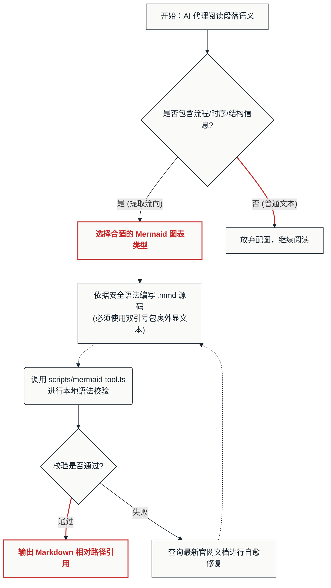

---

## 📖 详细步骤指导

### 步骤一：分析段落语义，进行图表选型 (Semantic Selection)
在视觉图纸（Spec）规划阶段，根据段落的语言特征和逻辑类型，对照下表选择最合适的 Mermaid 图表类型（严禁一律使用 Flowchart）：

| 逻辑特征 | 推荐图表类型 | 英文关键字 | 说明与适用场景 |
| :--- | :--- | :--- | :--- |
| **步骤、因果、决策分支、拓扑结构** | 流程图 | `flowchart TD` 或 `flowchart LR` | 表达行动指南、操作流程、系统组件拓扑。 |
| **多主体间的消息传递与时序流向** | 时序图 | `sequenceDiagram` | 接口调用、系统服务交互、人机对话过程。 |
| **历史演进、关键里程碑、时间脉络** | 时间线 | `timeline` | 发展历程、项目阶段总结、历史大事件盘点。 |
| **项目进度排期、工期依赖、资源冲突** | 甘特图 | `gantt` | 项目里程碑进度、研发排期、阶段耗时展示。 |
| **多维度定位、权重归类、战略评估** | 四象限图 | `quadrantChart` | 任务优先级划分（如价值 vs 难度）、产品定位。 |
| **数值流转分配、预算去向、能量损耗** | 桑基图 | `sankey-beta` | 资金分流、资源去向。**注意：标签严禁使用双引号。** |
| **趋势变化与类别数量对比** | XY 图表 | `xychart-beta` | 月度数据趋势、横向柱状对比（可组合折线与柱状图）。 |
| **多维属性素质分析、竞争力雷达** | 雷达图 | `radar-beta` | 候选人素质评估、多维度对比。**（需要 Mermaid v11+，本地不支持校验）** |
| **版本控制、代码分支、合并演进** | Git 提交流 | `gitGraph` | 代码提交流程说明、分支合并模式演示。 |
| **集合关系、交集并集、互斥对比** | 韦恩图 | `venn-beta` | 概念重叠区域、受众交集分析。**（需要 Mermaid v11+，本地不支持校验）** |
| **核心概念发散、多层树状解构** | 思维导图 | `mindmap` | 知识结构图、大纲大类拆解、脑图。 |

---

### 步骤二：读取 Spec 定义，提取色票与风格 (Reference Mapping)
**【禁止硬编码自定义颜色】**。你必须读取当前文章规划 spec (`[文件名].plan.md`) 中的颜色配置，直接映射到 Mermaid 的样式类定义（`classDef`）中：

1. **色盘映射关系**：
   * **`Background` (底色)** $\rightarrow$ 用于图表底层或常规节点底色。
   * **`Primary` (主色)** $\rightarrow$ 用于常规节点的线条边框与文字。
   * **`Accent` (点缀色)** $\rightarrow$ 用于核心/重点/特殊节点的高亮（填充底色或粗边框）。
   * **`Soft Fill` (浅填充)** $\rightarrow$ 用于辅助区域或次要节点的浅色填充。

2. **视觉流派映射 (以 Flowchart 为例)**：
   * **瑞士理性风 (Swiss)**：
     * 节点边框必须为直角（仅使用 `NodeID["Label"]`），严禁使用圆角。
     * 连接线必须平直（必须使用 `flowchart` 关键字，而非旧版 `graph`，以保证渲染出直角连线）。
     * 禁用渐变、阴影和 Emoji。
   * **Notion 极简手绘风 (Notion)**：
     * 节点边框使用圆角（使用 `NodeID("Label")`）。
     * 连线推荐使用虚线（如 `-.->`）表现轻量感。
     * 整体采用黑、白、灰色调，仅使用一个柔和的 Soft Fill 进行重点标记。

---

### 步骤三：语法安全防线与引号规则 (Syntax Guardrails)
Mermaid 的解析器非常脆弱，任何标点冲突都会导致渲染报错崩溃。必须严格遵守以下防错规则：

1. **对外展示的文本必须强制使用双引号包裹**：
   * ❌ *错误*：`A --> B(验证条件:成功?)` （冒号和括号会直接引发编译器崩溃）
   * ✓ *正确*：`A --> B("验证条件:成功?")`
2. **换行与富文本处理**：
   * 双引号内的内容会送入 Markdown 渲染器解析。
   * **换行**：请统一使用 `<br/>` 标签进行换行（如 `Node["第一行文本<br/>第二行文本"]`）。
   * **文本强调**：如果需要粗体，使用 Markdown 格式（如 `Node["**核心高亮**"]`）。

---

## 📐 三、 语法解析过程与安全防线 (Syntax Parsing & Guardrails)

为了让你直观理解为什么 Mermaid 对标点如此敏感，下面用**状态图 (State Diagram)** 解释 Mermaid 的语法解析生命周期。请将此图作为状态图的**自解释示例**。

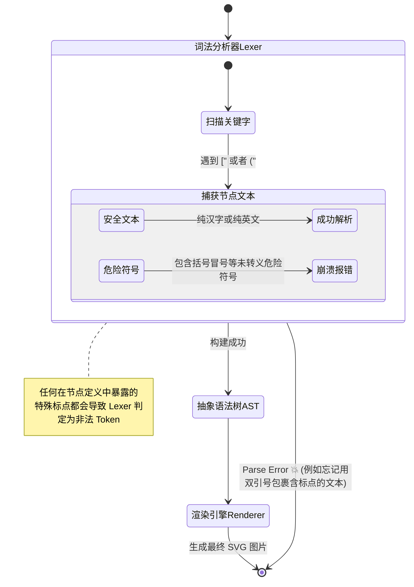

> [!CAUTION]
> **语法防错核心结论**：
> 1. **对外展示的文本必须强制使用双引号包裹**：`A --> B("验证条件:成功?")`
> 2. **换行**：请统一使用 `<br/>` 标签进行换行。
> 3. **缩进**：不要在关键字（如 `sankey-beta`）后面或前面随意加空格，换行后顶格写或遵循2空格缩进即可。

---

## 📋 四、 11 种自解释经典场景 Demo 代码 (Recipes)

你可以直接复制以下完整的可运行代码进行基底修改（代码中已用注释标明样式自定义方式）：

（参考第二节的“执行步骤概览”流程图，此处不再赘述）

### 2. Sequence Diagram (时序图)

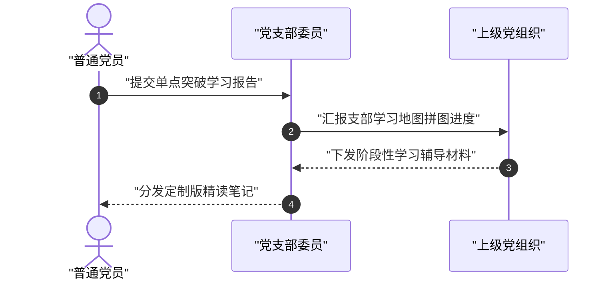

### 3. Timeline Diagram (时间线)

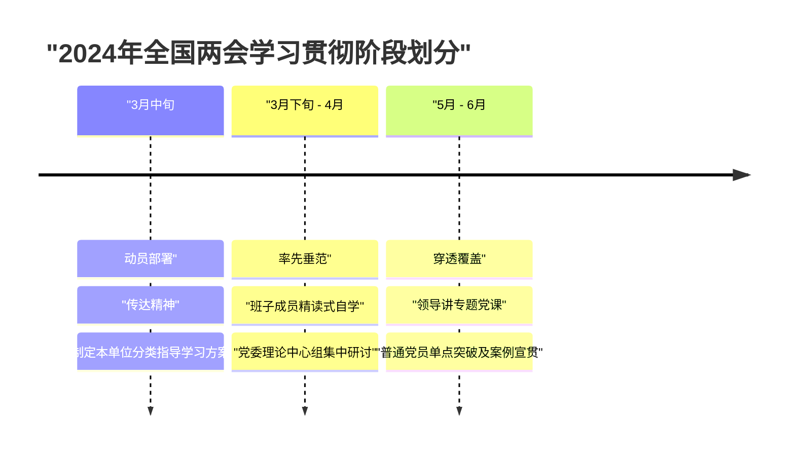

### 4. Gantt Chart (甘特图)

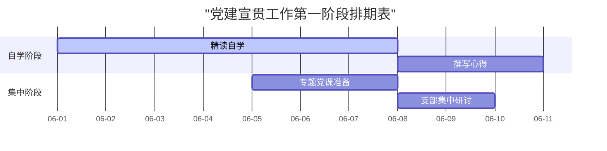

### 5. Quadrant Chart (四象限图)

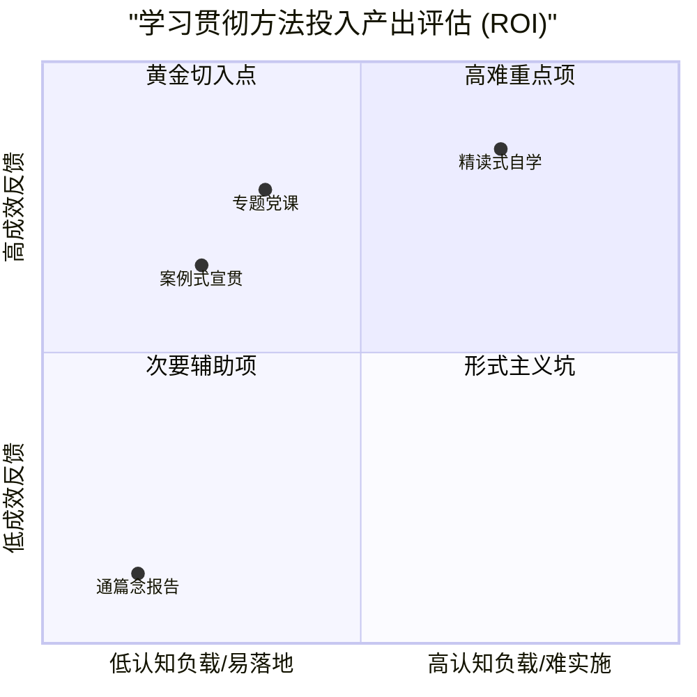

### 6. Sankey Diagram (桑基图) [注意：包含中文时本地 CLI 会报错]
> [!WARNING]
> Mermaid v10.9（本地验证版本）的 Sankey 解析器对非ASCII字符支持存在缺陷，若节点包含中文必定会报 `NON_ESCAPED_TEXT` 错误。
> *   **应对方案**：在生成最终文档时，你可以直接输出含中文的 Sankey 源码并**主动跳过本地验证**（下游 v11+ 渲染管线能正常渲染）。
> *   **为了让本文档能通过本地测试脚本，下面的演示代码暂时全用纯英文 ASCII**：

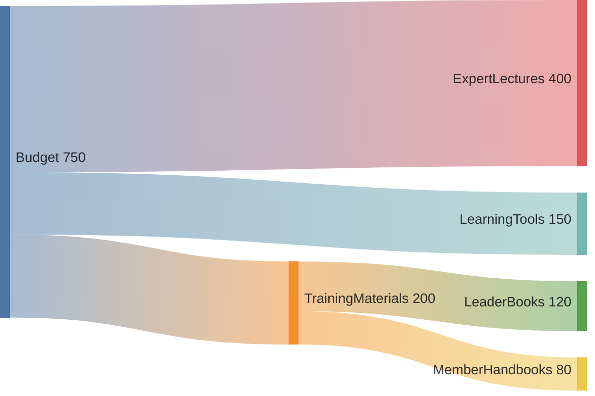

### 7. XY Chart (XY图表)

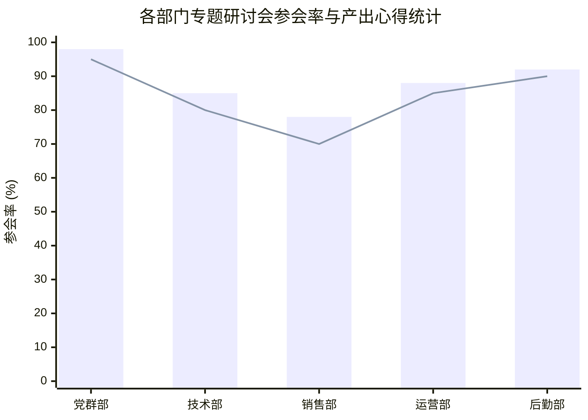

### 8. Radar Diagram (雷达图)

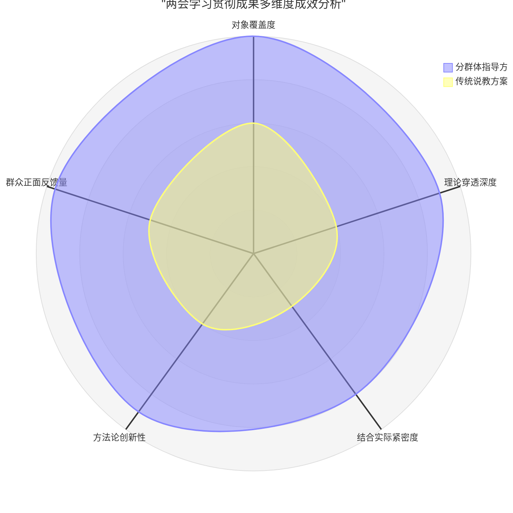

### 9. Git Graph (Git 提交流/分支版本演进)

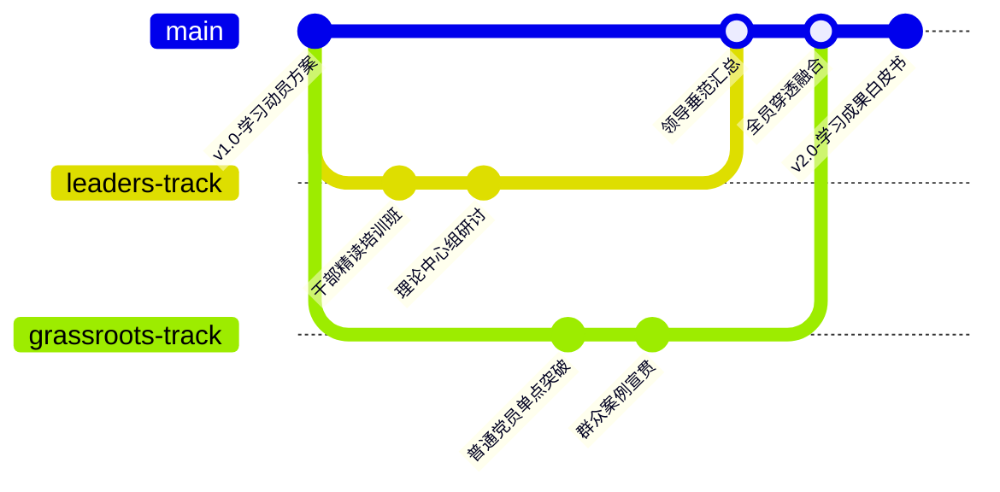

### 10. Venn Diagram (韦恩图)

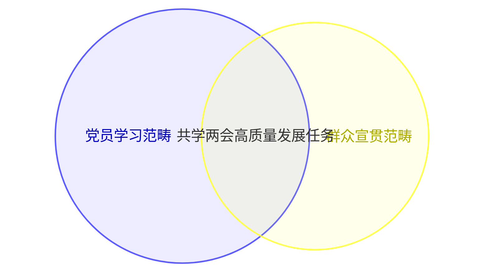

### 11. Mindmap (思维导图)

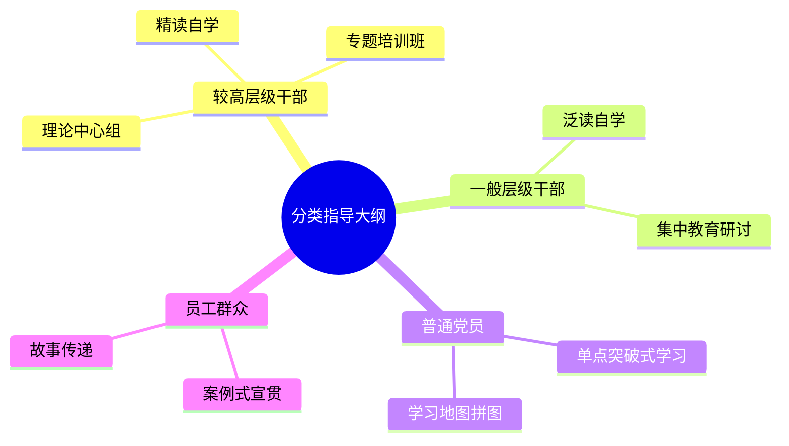

---

## 🛠️ 五、 校验、输出与交付规范 (Validation & Delivery)

### 1. 本地语法安全校验
在向工作区保存图表之前，你必须使用本地的 `mermaid-tool.ts` 脚本对代码进行语法验证：
```bash
npx tsx scripts/mermaid-tool.ts --validate-only --code "YOUR_MERMAID_CODE"
```
> [!WARNING]
> **版本局限性处理**：
> 本地开发环境的 `pretty-mermaid` CLI 使用的是 Mermaid v10.9.0，因此无法识别 `radar-beta` 与 `venn-beta`。
> *   对除了雷达图和韦恩图之外的 **9 种图表**，如果验证返回错误，必须立即根据诊断日志修复代码，切勿将破损的语法写入文件。
> *   对 **雷达图 (`radar-beta`)** 与 **韦恩图 (`venn-beta`)**，在确定语法符合最新官方标准的情况下，**可以跳过本地校验直接保存为 `.mmd`**，下游渲染管线会自动处理。

### 2. 后缀名与文件命名规范
*   **后缀名要求**：所有的 Mermaid 图表必须以原生的 **`.mmd`** 源码文件进行物理保存（下游将有渲染管线统一处理），绝对不能保存为 `.svg` 或 `.png`。
*   **物理保存路径**：默认保存在正文同级目录下的 `./images/` 中。
*   **命名公式**：`[article-slug]-[content-focus]-chart.mmd`

### 3. Markdown 中的引用与交付输出 (统一 I/O 契约)
图表生成并校验完毕后，**不要修改用户的正文 MD 文件**。Agent 必须将产出结果以单行标准格式**追加写入**到原始文章同级目录下的 `[原文章名].cand.md` 清单文件中：

```markdown
<建议插入行号>: 
```

*示例*：
```markdown
105: 
```

同时可以在对话中向用户展示源码，但写入 `*.cand.md` 是自动装配的前置动作。

---

## 🚨 六、 语法容灾与自愈协议 (Error Recovery Protocol)

由于 Mermaid 的图表语法在不断演进（例如带有 `-beta` 标识的图表类型未来可能会变更为正式版），如果你在调用本地 `scripts/mermaid-tool.ts` 进行语法校验时，遇到解析报错（例如：`Invalid Mermaid code...`）：

> [!CAUTION]
> **绝对不允许猜测语法**。你必须立刻使用 **网页内容获取工具** 访问以下官方文档路径查阅最新的语法标准与关键字：
> *   官方语法主入口：[https://mermaid.ai/open-source/syntax/](https://mermaid.ai/open-source/syntax/)
> *   具体图表子页面，例如：
>     *   `https://mermaid.ai/open-source/syntax/flowchart.html`
>     *   `https://mermaid.ai/open-source/syntax/radar.html`
>     *   `https://mermaid.ai/open-source/syntax/sankey.html`
> 
> 读取最新的官方语法，修复本地代码，并重新调用 `scripts/mermaid-tool.ts --validate-only` 进行校验，直至完全通过。
