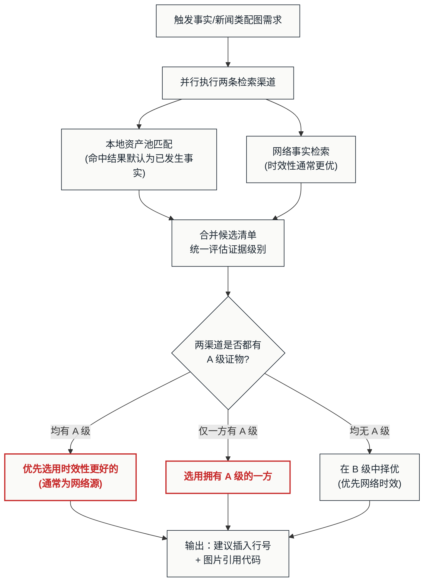

# 🔍 媒体资产检索与真实证据配图指南 (Media Search & Retrieval Guide)

## 📌 核心使命

本模块区别于其他配图路径（Mermaid 逻辑图、SVG 版式卡片、Gen-AI 氛围插画）的根本之处在于：

> **它的目的不是"好看"，而是"让读者相信"。**

当正文出现事实性陈述（突发新闻、历史事实、时政信息、权威科技动态等）时，配图的核心职责是提供**真实的视觉证据**，与文字形成互证——读者看到现场照片后，会自然地对文字内容产生信任。美观是次要的，可信度和与文字的呼应才是本模块的生命线。

因此，本模块产出的图片与其他路径（Mermaid / SVG / Gen-AI）的设计图之间实行**视觉双轨制**：
*   **证据图（本模块产出）**：保留原始照片的色彩、光影和真实感，不做风格化处理，不强行统一为全篇设定的设计色盘。
*   **设计图（其他路径产出）**：继续遵循 `*.plan.md` 中设定的视觉流派与三色盘。

两者的反差是合理的——它向读者传递了清晰的信号：**照片是客观发生的事实，卡片是主观提炼的方法论。**

---

## 📂 一、 两条检索渠道

本指南规范两类图片获取渠道：

1. **本地资产池检索 (Local Asset Harvesting)**：通过 TypeScript 脚本跨工作区模糊匹配已有 MD 文件中的图片引用。**本地资产池匹配命中的图片，默认即为已发生的事实。**
2. **事实新闻类网络检索 (News & Factual Hotlinking)**：基于上下文关键词从官方媒体检索新闻图片，采用远程热链引用（无需下载物理文件）。**网络图片的时效性通常优于本地资产。**

在事实/新闻类配图场景中，Agent 必须**同时触发两条渠道**，将本地匹配结果与网络检索结果放在一起进行证据级别对比，择优选用。

---

## 📂 二、 本地资产池匹配逻辑与 TypeScript 脚本规范

为了避免重复下载相同的图片，系统必须支持跨工作区检索已有 MD 文件中的图片引用。

### 1. 资产收割脚本执行流程

```mermaid
flowchart TD
    classDef default fill:#FAFAF8,stroke:#1A2530,stroke-width:1px,color:#1A2530;
    classDef highlight fill:#FAFAF8,stroke:#C62828,stroke-width:2px,color:#C62828,font-weight:bold;

    A["启动扫描 (TS 脚本)"] --> B["递归遍历工作区中所有 .md 文件"]
    B --> C["正则匹配图片模式: `!\\[(.*?)\\]\\((.*?)(?:\\s+\"(.*?)\")?\\)`"]
    C --> D{"匹配到 Alt 或 Title 吗?"}
    
    D -->|"是"| E["与目标配图关键词进行模糊匹配<br/>(Levenshtein 距离或分词包含)"]
    D -->|"否"| B
    
    E --> F{"相似度是否超过阈值?"}
    F -->|"超过"| G["物理复制源图片文件<br/>到当前主文档的资源相对路径下"]
    F -->|"未超过"| B
    
    G --> H["追加记录至 cand-local-images.md"]
    H --> I["动态更新 cand-local-images.md 中的<br/>所有图片相对引用路径"]
    I --> B
    
    B --> End["输出 cand-local-images.md 候选清单"]:::highlight
```

### 2. 检索脚本核心代码实现参考 (TypeScript)

在项目中，可运行以下逻辑的 TS 脚本实现本地匹配：

```typescript
import * as fs from 'fs';
import * as path from 'path';

interface ImageAsset {
  alt: string;
  url: string; // 原始路径
  title?: string;
  sourceFile: string;
}

// 核心匹配逻辑：Levenshtein 距离模糊匹配
function fuzzyMatch(str1: string, str2: string): boolean {
  const s1 = str1.toLowerCase();
  const s2 = str2.toLowerCase();
  if (s1.includes(s2) || s2.includes(s1)) return true;
  
  // 简单编辑距离实现
  const track = Array(s2.length + 1).fill(null).map(() =>
    Array(s1.length + 1).fill(null));
  for (let i = 0; i <= s1.length; i += 1) track[0][i] = i;
  for (let j = 0; j <= s2.length; j += 1) track[j][0] = j;
  for (let j = 1; j <= s2.length; j += 1) {
    for (let i = 1; i <= s1.length; i += 1) {
      const indicator = s1[i - 1] === s2[j - 1] ? 0 : 1;
      track[j][i] = Math.min(
        track[j][i - 1] + 1, // deletion
        track[j - 1][i] + 1, // insertion
        track[j - 1][i - 1] + indicator // substitution
      );
    }
  }
  const distance = track[s2.length][s1.length];
  const maxLength = Math.max(s1.length, s2.length);
  const similarity = 1 - distance / maxLength;
  return similarity > 0.65; // 相似度阈值设定为 65%
}

// 扫描并复制资产的主函数
export function harvestAssets(
  workspaceDir: string, 
  targetArticlePath: string, 
  keyword: string,
  candLogPath: string
) {
  const imagesFound: ImageAsset[] = [];
  const mdImageRegex = /!\[(.*?)\]\((.*?)(?:\s+"(.*?)"\)?)/g;

  // 递归扫描... (读取所有 md 文件并匹配正则，放入 imagesFound)
  
  // 处理命中的匹配项
  imagesFound.forEach(img => {
    if (fuzzyMatch(img.alt, keyword) || (img.title && fuzzyMatch(img.title, keyword))) {
      const sourceImgPath = path.resolve(path.dirname(img.sourceFile), img.url);
      if (fs.existsSync(sourceImgPath)) {
        const destDir = path.join(path.dirname(targetArticlePath), 'images');
        if (!fs.existsSync(destDir)) fs.mkdirSync(destDir, { recursive: true });
        
        const fileExt = path.extname(sourceImgPath);
        const newFileName = `${path.basename(targetArticlePath, '.md')}-${Date.now()}${fileExt}`;
        const destImgPath = path.join(destDir, newFileName);
        
        // 1. 物理复制图片
        fs.copyFileSync(sourceImgPath, destImgPath);
        
        // 2. 将此纪录写入 cand-local-images.md，确保其路径相对于 candLogPath 正确
        const relativeUrlToCand = path.relative(path.dirname(candLogPath), destImgPath);
        const markdownLine = `\n`;
        fs.appendFileSync(candLogPath, markdownLine);
      }
    }
  });
}
```

---

## 📰 三、 事实/新闻类网络检索与免下载配图规范

当文章涉及突发新闻、历史事实或时政信息（如"SpaceX 上市"、"Trump 访华"、"爪哇岛地震"）时，应检索官方媒体或权威机构发布的新闻大图。为了保持新闻时效性并遵守版权分发限制，**此类配图采用"远程热链 (Hotlink)"方案，无需下载物理文件**。

### 1. 检索与校验执行流

1. **上下文实体提取 (Contextual Parsing)**：
   - 分析插图锚点前后 2-3 个段落，提取核心的"时间-地点-人物-事件"实体。
   - 组装搜索引擎的查询指令。例如：`SpaceX IPO launch site news photo` 或 `Trump Beijing visit official bilateral meeting`。

2. **官媒定向过滤 (Authority Filtering)**：
   - 过滤搜索结果，优先选择权威机构或官方主流新闻媒体的图片源（如新华社、路透社、NASA 官网、TechCrunch 等）。
   - 严禁引用微博、贴吧等个人社交媒体或博客网站的二次转载图。

3. **多模态视觉核验 (Multimodal Vision Inspection)**：
   - **核心步骤**：Agent 必须使用多模态大模型的"图片阅读/视觉感知"功能，传入图片 URL 直接阅读其具体画面内容。
   - **审查重点是"防伪与防穿帮"，而非"防丑"**：
     - **实体准确性**：画面是否确实包含提取的实体？（如：图片中是否确实是 SpaceX 发射场？是否真的有特朗普与中方会晤的会场？）
     - **时间穿帮**：画面中的背景文字、大屏幕年份、横幅标语等是否与文章所述时间一致？（严防将其他年份、其他会议的照片张冠李戴。）
     - **实体错乱**：是否把无关会议（如地方两会、企业年会）的图片误匹配为全国两会？
     - **无二次水印**：图片边缘是否存在商业素材网的透明大水印或第三方自媒体 LOGO？
     - **无视觉噪声**：图片是否干净？是否存在明显的广告 Banner、牛皮癣小广告、界面遮挡或不可读乱码？

4. **统一 I/O 契约输出**：
   - 校验与对比决策完成后，**不要修改用户的正文 MD 文件**。Agent 必须将最终选用的图片结果（无论是本地复制的文件路径还是远程 URL）以单行标准格式**追加写入**到原始文章同级目录下的 `[原文章名].cand.md` 清单文件中：
     ```markdown
     <建议插入行号>: 
     ```
   - *示例*：
     ```markdown
     23: 
     ```
   - 同时可以在对话中向用户展示最终对比选择的过程和结果。

---

## 🏷️ 四、 证据级别评估与对比选用规则

在事实/新闻类场景中，Agent 同时触发本地资产池匹配与网络事实检索后，必须将两类结果放在一起，按以下**证据级别 (Evidentiary Grade)** 进行评估和排序，择优选用：

### 1. 证据级别定义

| 级别 | 定义 | 示例 | 选用优先级 |
| :--- | :--- | :--- | :--- |
| **A 级 — 直接现场证物** | 展示事件发生当下的、包含核心实体要素的官方现场照片 | 两会闭幕会现场、SpaceX 发射瞬间、地震救援前线 | **最优先** |
| **B 级 — 关联实体证物** | 虽非事件当下，但包含高度相关的核心实体（场所、人物、装备等） | 人民大会堂外景、SpaceX 火箭静态展示、震区地貌 | 次优先 |
| **C 级 — 泛化背景素材** | 仅提供地理或主题背景，无法直接佐证具体事件 | 北京城市鸟瞰、通用航天概念图、泛地震废墟 | 仅在 A/B 级缺失时使用 |

### 2. 对比选用决策逻辑



**关键规则**：
*   **新闻/事实类场景，网络图片的时效性天然优于本地存量资产**，因此在同等证据级别下，**优先选用网络图片**。
*   本地资产池匹配命中的图片默认即为已发生的事实（具备可信度），但其拍摄时间、图源权威性可能不如刚检索到的官方网络新闻图。
*   若网络检索未能找到可靠结果（搜索无果或未通过多模态核验），则退回选用本地匹配到的事实资产。

---

## 📝 五、 路由判定总表

在执行路由选择时，`3. illustration-routing-guide.md` 将根据以下准则决定何时分流至本模块：

| 场景特征 | 检索渠道 | 选用动作 |
| :--- | :--- | :--- |
| **段落描述为宏观历史事实、实时新闻、权威科技动态** | **同时启用**：本地资产池匹配 与 网络事实检索 | 合并结果，按证据级别对比。同等级别下**优先网络图片（时效性更好）**；本地命中的默认为已发生事实，作为兜底。 |
| **仅为非事实类的通用插图或特定主题素材复用** | 本地资产池 (`harvestAssets` 脚本) | 执行匹配，物理复制图片，更新 `cand-local-images.md` 并直接复用。 |
