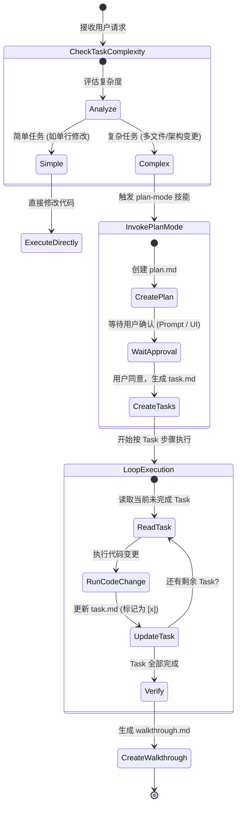

# Plan-Mode (Cognitive Architecture Router)

This skill overrides the default reactive behavior of the agent and enforces a deliberate, phased execution workflow. 

**CRITICAL RULE**: Do NOT load all reference files at once. You MUST execute this workflow phase-by-phase, and only load the specific instruction file from `references/` when you transition into that phase.

---

## 📐 Phased Execution State Machine

---

## 🔀 Phase Routing Map

Follow this exact sequence. Read the corresponding file only when you enter that phase.

1. **[P0] Complexity Analysis** ──→ Read `references/phase_0_complexity_analysis.md`
   - Evaluate if the request needs a plan or can be done immediately.
   - If complex, move to P1.

2. **[P1] Planning & Approval** ──→ Read `references/phase_1_planning.md`
   - Research the codebase. Write the plan using `templates/plan.md`.
   - **STOP** and wait for human approval. Document feedback in `templates/review.md` if necessary.

3. **[P2] Task Decomposition** ──→ Read `references/phase_2_task_decomposition.md`
   - After approval, break the plan down into atomic steps using `templates/task.md`.

4. **[P3] Execution Loop** ──→ Read `references/phase_3_execution.md`
   - Execute tasks one by one. Update `task.md` synchronously.

5. **[P4] Verification** ──→ Read `references/phase_4_verification.md`
   - Validate the work. Summarize using `templates/walkthrough.md`.

---

## ⚠️ Core Guardrails

1. **No Code Without Plan**: In P1, you are strictly forbidden from making structural edits, modifying source code, or running mutating bash commands (like `npm install` or `git commit`) until the plan is approved.
2. **Synchronous State**: In P3, you must update `task.md` after every single logical step. Do not execute 5 tasks and then update the tracker all at once.
3. **Language Context**: The generated output in `plan.md`, `task.md`, `review.md`, and `walkthrough.md` should match the user's input language (e.g., if the user speaks Chinese, write the plan in Chinese).
