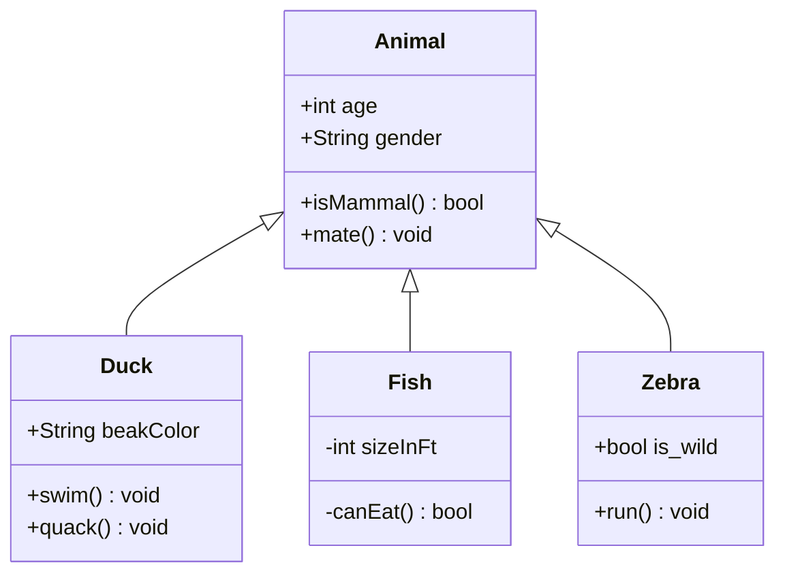
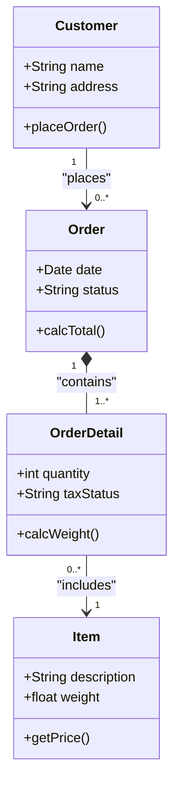

# 类图 (Class Diagram) 绘图指南

## 适用场景
类图非常适合展示：
- 面向对象系统的结构
- 类、接口及其属性和方法
- 类之间的关系（继承、实现、关联、依赖等）
- 数据库实体关系（也可以用 ER 图）

## 语法要点
- 定义类：`class ClassName` 或 `class ClassName { ... }`
- 属性和方法：`+` (public), `-` (private), `#` (protected), `~` (package/internal)
- 关系：
  - `<|--` (继承/泛化)
  - `*--` (组合)
  - `o--` (聚合)
  - `-->` (关联)
  - `..>` (依赖)
  - `..|>` (实现)
- 关系标签：`--> "标签" : "描述"`
- **重要规范**：任何需要显示的文本（如类名、属性名、方法名、关系标签等）如果包含特殊字符或空格，建议被双引号包围。类的内部命名应该具有自解释性。

## 美观示例

### 1. 动物继承关系

### 2. 订单系统类图

