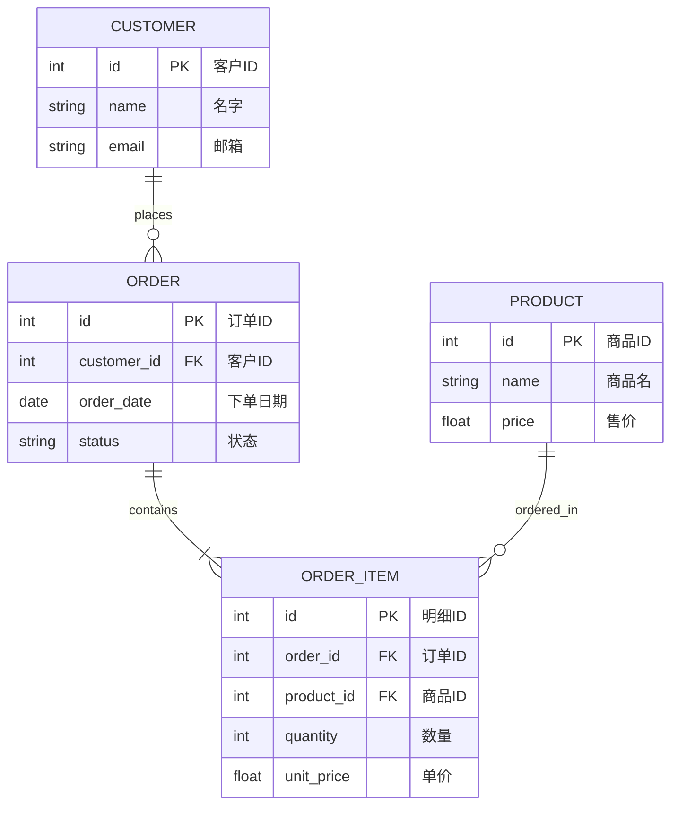
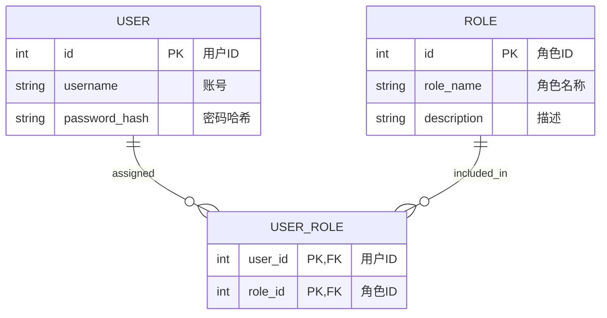

# 实体关系图 (Entity-Relationship Diagram) 绘图指南

## 适用场景
ER 图非常适合展示：
- 关系型数据库的表结构设计。
- 业务系统中的核心实体及它们之间的关联性。
- 数据模型与外键映射关系。

## 语法要点
- **声明类型**：第一行写入 `erDiagram`。
- **实体定义**：
  ```mermaid
  erDiagram
      ENTITY_NAME {
          type attribute_name PK "描述说明"
          type attribute_name FK "描述说明"
      }
  ```
- **基数/关系符号**：
  - `|o` : 0 或 1 (Zero or One)
  - `||` : 恰好 1 (Exactly One)
  - `}o` : 0 或多 (Zero or More)
  - `}|` : 1 或多 (One or More)
- **关系线声明格式**：`EntityA 关系符号--关系符号 EntityB : "关系说明"`
  - 例如：`CUSTOMER ||--o{ ORDER : "places"` (一个客户可以下 0 到多个订单，一个订单必须属于一个客户)
- **重要规范**：
  - 关系描述（如上面的 `"places"`）必须加双引号。
  - 属性的修饰词（如 PK、FK）必须大写，后面的说明文字也必须加双引号。

## 美观示例

### 1. 典型电商系统数据模型


### 2. 用户与权限设计 (多对多关系拆分)

