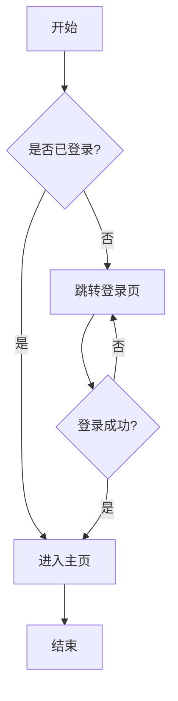
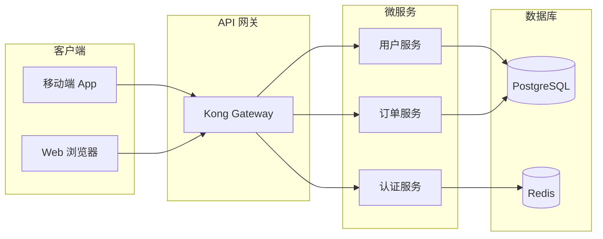

# 流程图 (Flowchart) 绘图指南

## 适用场景
流程图非常适合展示：
- 算法或程序的逻辑流程
- 业务审批或操作流程
- 系统架构图（通过节点和连接线展示组件关系）
- 决策树

## 语法要点
- 支持的方向：`TD` (从上到下), `LR` (从左到右), `BT` (从下到上), `RL` (从右到左)
- 节点形状：`[矩形]`, `(圆角矩形)`, `{菱形/判断}`, `((圆形))` 等
- 连接线：`-->` (实线箭头), `---` (实线), `-.->` (虚线箭头), `==>` (粗线箭头)
- 标签：`-->|"标签文本"|`
- **重要规范**：任何需要显示的文本都需要被双引号包围，并且节点的内部命名应该具有自解释性，而不是使用ABCD这种抽象名称。

## 美观示例

### 1. 基础业务流程

### 2. 系统架构图 (带子图)

