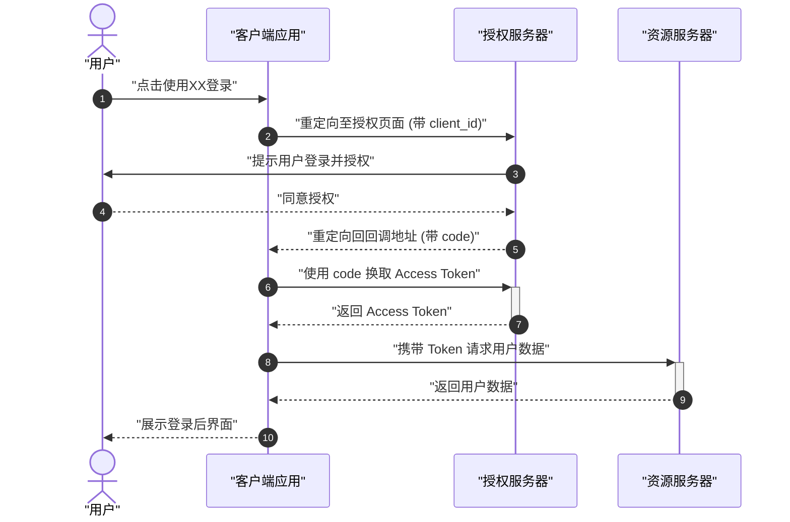

# 时序图 (Sequence Diagram) 绘图指南

## 适用场景
时序图非常适合展示：
- 多个对象或组件之间的交互顺序
- API 请求和响应的生命周期
- 协议的握手过程
- 随时间发生的消息传递

## 语法要点
- 参与者：`participant A as "显示名称"`, `actor B as "显示名称"`
- 消息：`->>` (实线箭头，请求), `-->>` (虚线箭头，响应), `-x` (异步消息)
- 激活框：`activate A` / `deactivate A`，或使用快捷方式 `A->>+B:` 和 `B-->>-A:`
- 逻辑控制：`alt`/`else` (条件), `opt` (可选), `loop` (循环)
- 备注：`Note right of A: "备注内容"`
- **重要规范**：任何需要显示的文本都需要被双引号包围，并且参与者的内部命名应该具有自解释性。

## 美观示例

### 1. OAuth 2.0 授权码流程

