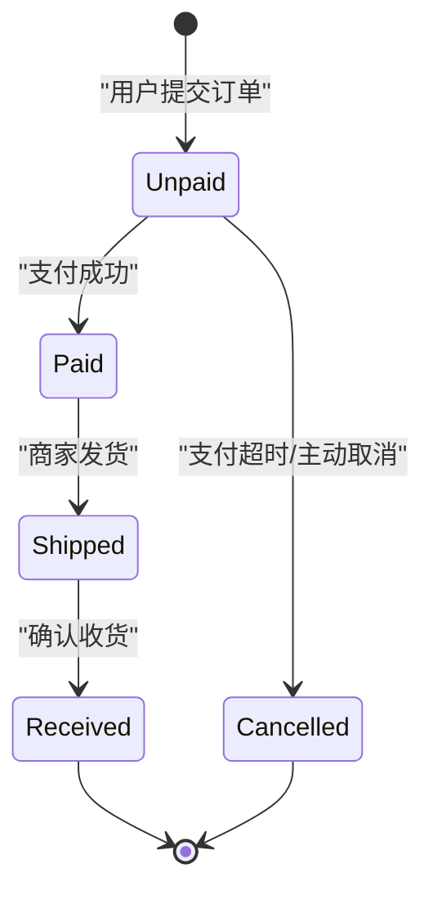
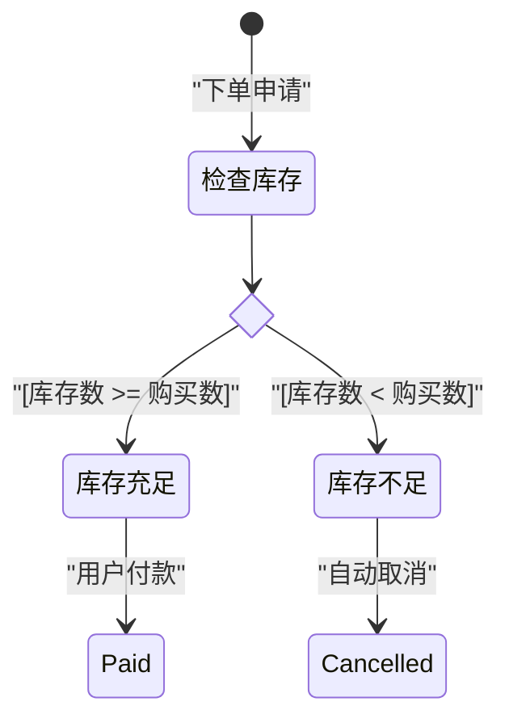
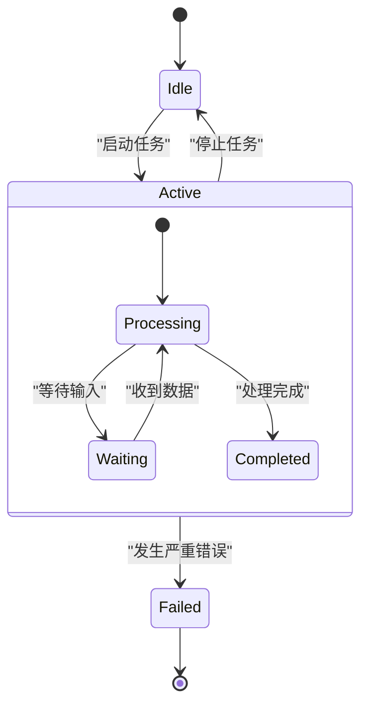

# 状态图 (State Diagram) 绘图指南

## 适用场景
状态图非常适合展示：
- 对象、系统或流程在生命周期内的各种状态变化。
- 复杂对象（如订单、工作流、硬件设备）的状态迁移逻辑。
- 协议或系统的行为逻辑（如 TCP 状态机、游戏引擎中的角色状态）。

## 语法要点
- **声明类型**：推荐使用新语法：`stateDiagram-v2`。
- **起点与终点**：
  - 起始状态：`[*] --> 状态1`
  - 结束状态：`状态2 --> [*]`
- **转换描述**：
  - 带描述的转换：`State1 --> State2 : "转换事件/触发条件"`
- **状态名与别名**：
  - 如果状态名称中包含空格或特殊字符，可以使用 `state "状态显示文本" as state_id` 来定义别名。
- **复合状态（子状态）**：
  - 可以使用 `state 复合状态名 { ... }` 来定义嵌套子状态。
- **分支/汇合**：
  - 分支/选择节点：使用 `<<choice>>` 声明。
  - 分叉与合并节点：使用 `<<fork>>` 和 `<<join>>` 声明。
- **重要规范**：状态转换的描述文本必须被双引号包围，例如 `--> State2 : "Success"`，以防止解析错误。

## 美观示例

### 1. 简易订单生命周期

### 2. 带有选择分支的逻辑

### 3. 复合状态（嵌套）

