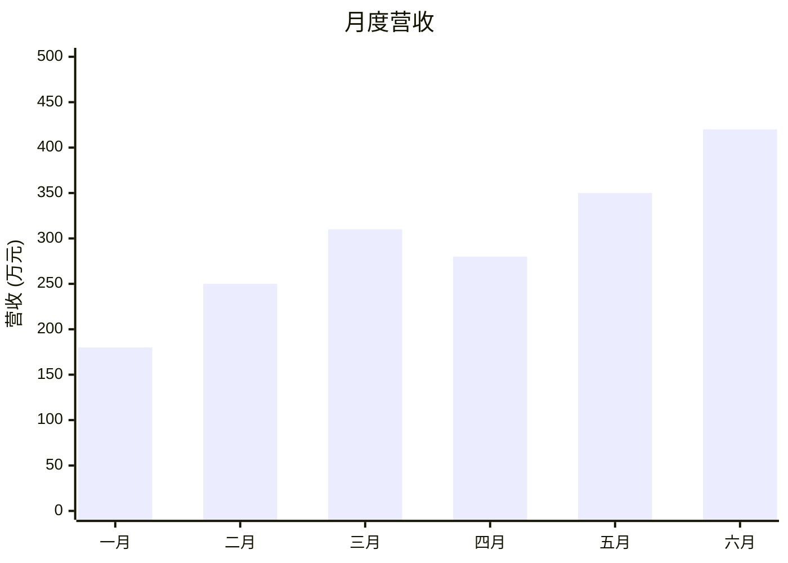
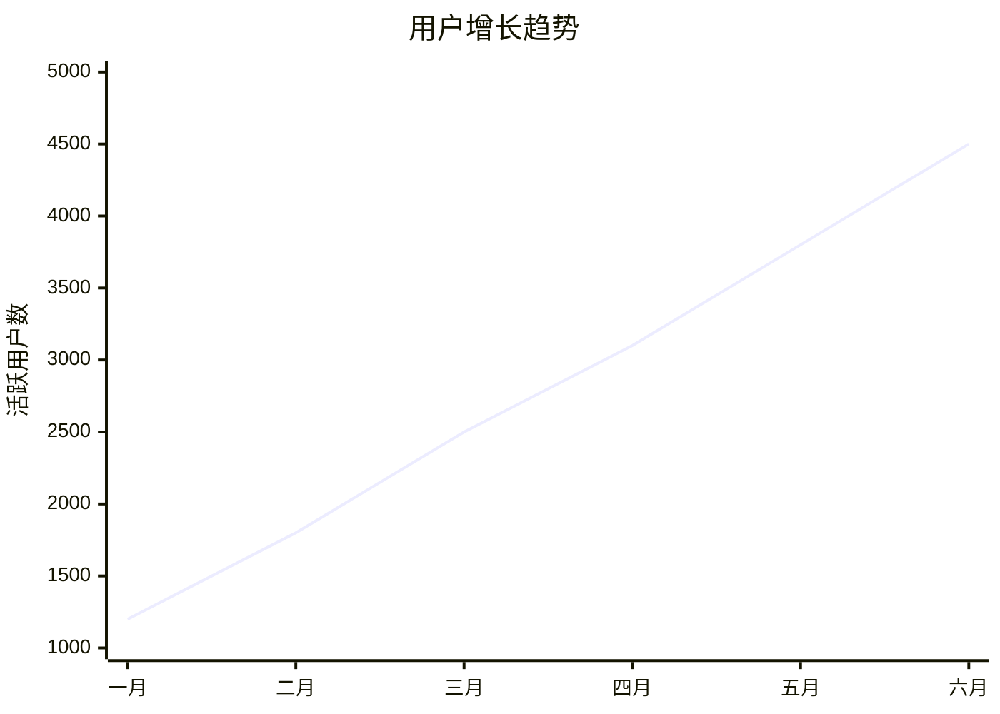
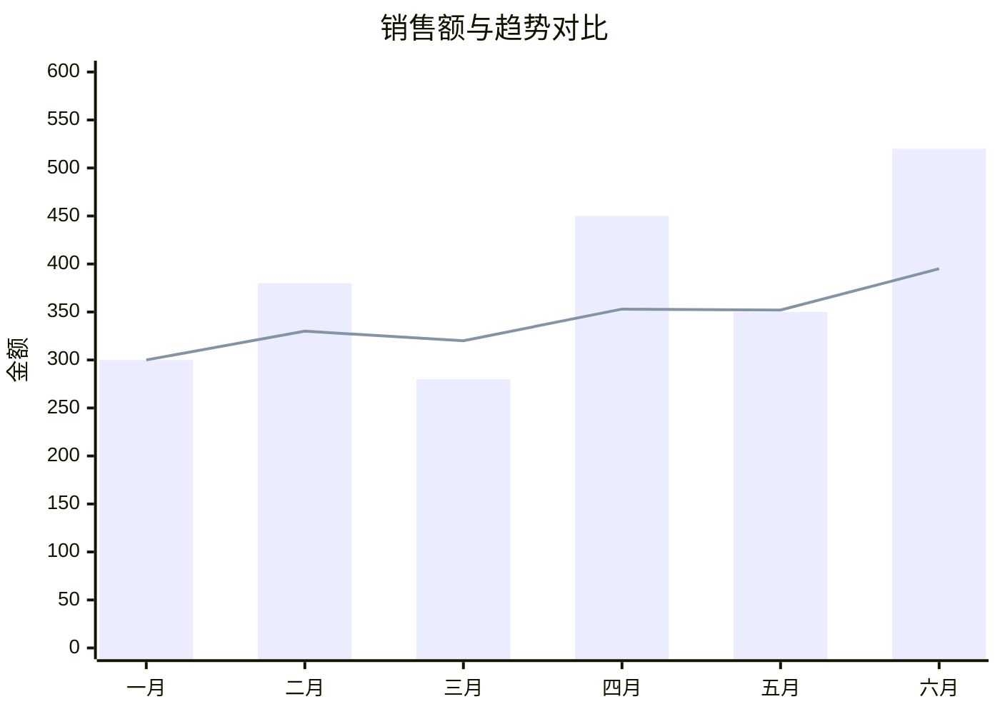
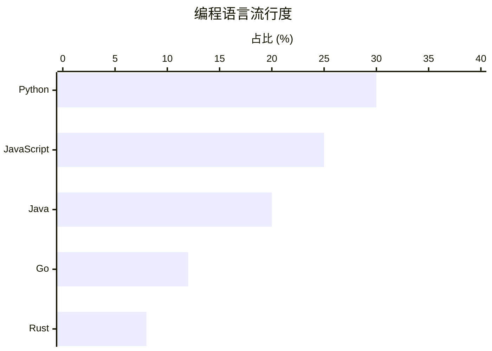

# XY 图表 (XY Chart) 绘图指南

## 适用场景
XY 图表非常适合展示：
- 随时间变化的趋势（折线图）
- 不同类别的数据对比（柱状图）
- 趋势与对比的结合（折线图+柱状图组合）

## 语法要点
- 声明：`xychart-beta`
- 标题：`title "图表标题"`
- X 轴：
  - 类别：`x-axis ["类别1", "类别2", "类别3"]`
  - 范围：`x-axis 0 --> 100`
  - 带标题：`x-axis "X轴标题" ["A", "B"]`
- Y 轴：`y-axis "Y轴标题" 0 --> 500`
- 数据系列：
  - 柱状图：`bar [10, 20, 30]`
  - 折线图：`line [15, 25, 35]`
- 方向：添加 `horizontal` 关键字可变为水平图表
- **重要规范**：任何需要显示的文本（如标题、轴标签、类别名称等）都需要被双引号包围。

## 美观示例

### 1. 基础柱状图

### 2. 基础折线图

### 3. 柱状图与折线图组合

### 4. 水平柱状图

