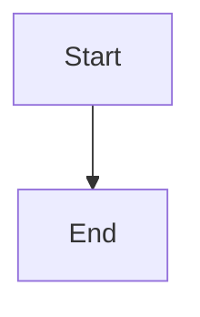

# 矢量与图表渲染规范 (Diagram Action Spec)

本文档隶属于 [Markdown Action Annotation](./README.md) 标准体系，专门规范与**代码转视图**（如 Mermaid、PlantUML、纯数据生成的 SVG 卡片）渲染相关的动作。

在使用 `pretty-mermaid` 或 `markdown-illustrator` 的图表分支时，请严格遵守本类指令。

## 1. 渲染代码块为图表 (RENDER_DIAGRAM)

用于通知排版引擎或渲染 Agent（如 `mermaid-cli` 包装器），将紧随其后的代码块编译为可见的位图或 SVG 并替换到正文中。

### 参数规范
*   **`ACTION="RENDER_DIAGRAM"`**
*   **`STATUS`**: `TODO` -> `DONE`
*   **`ID`**: 全局唯一标识符
*   **`ENGINE`**: 指定用于渲染代码的引擎名称。支持的枚举：`Mermaid`, `PlantUML`, `Graphviz`。
*   **`THEME`**: （可选）指定的渲染主题色彩，例如 `tokyo-night`, `github-light`。

### 示例
```html
<!-- ACTION="RENDER_DIAGRAM" STATUS="TODO" ID="diag-mer-01" ENGINE="Mermaid" THEME="tokyo-night" -->

```

### 接力栈说明
当渲染完成后，负责的 Agent 应将原注解改为 `DONE`，保留原代码块供参考，并在下方插入指向生成图片的链接，通常还会根据需要追加发布指令（`UPLOAD_ASSET`）。

---

## 2. 生成 SVG 知识卡片 (GENERATE_SVG_CARD)

用于 `markdown-illustrator` 中的卡片生成分支，将一段结构化数据（通常是 JSON 格式的列表或名片信息）结合代码模板转化为精美的矢量卡片（SVG）。

### 参数规范
*   **`ACTION="GENERATE_SVG_CARD"`**
*   **`STATUS`**: `TODO` -> `DONE`
*   **`ID`**: 全局唯一标识符
*   **`TEMPLATE`**: 指定 SVG 的排版模板类型，例如 `list-card`（列表卡片）, `profile-card`（人物名片）。
*   **`DATA`**: 核心结构化数据，用于传入模板进行数据绑定。请注意，内部如果有双引号必须写成 `&quot;` 或单引号 `'` 以确保 HTML 属性解析安全。

### 示例
```html
<!-- ACTION="GENERATE_SVG_CARD" STATUS="TODO" ID="svg-card-01" TEMPLATE="list-card" DATA="[{'title':'新材料','desc':'慧谷新材'},{'title':'流体回路','desc':'航天晨光'}]" -->

```
